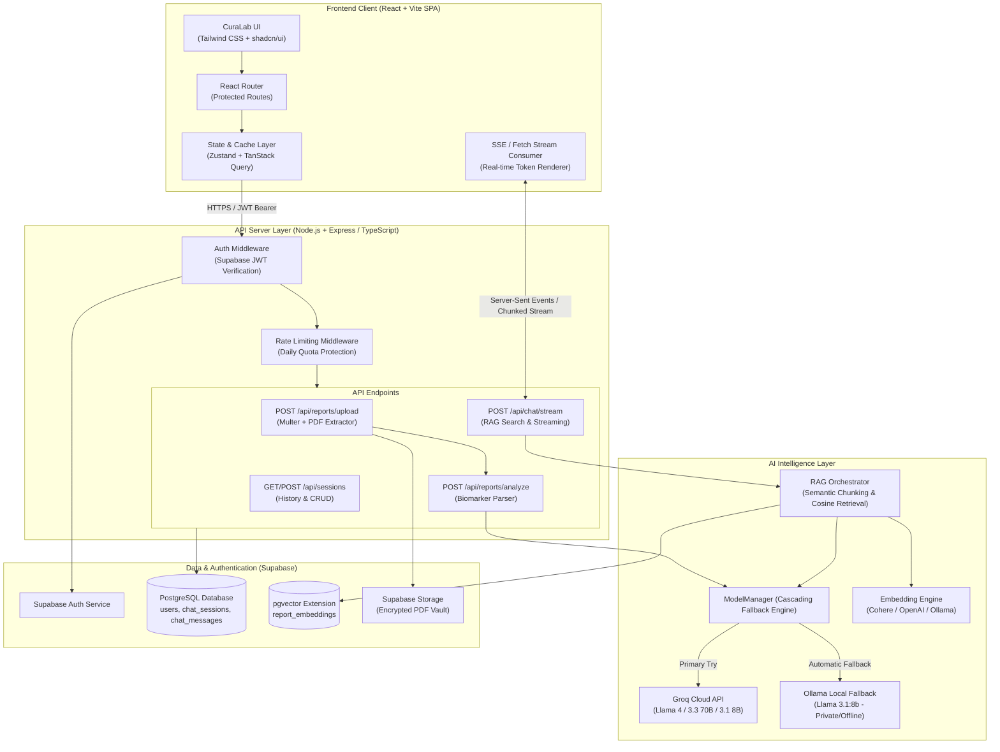

# 🩺 CuraLab AI — Clinical Laboratory Intelligence & Biomarker Analytics Platform

<div align="center">


**Turn complex medical laboratory reports into clear, structured biomarker insights and interactive doctor-ready follow-ups.**

[Features](#-key-features) • [Architecture](#-system-architecture) • [CI/CD & Deployment](#--cicd-pipeline--vercel-deployment) • [Tech Stack](#-technology-stack) • [Quick Start](#-quick-start) • [Clinical Safety](#-clinical-safety--disclaimer)

</div>

---

## 🌟 Overview

**CuraLab AI** is an intelligent, full-stack clinical laboratory analytics and biomarker interpretation platform. Built for patients and healthcare providers, it simplifies the understanding of laboratory test reports (PDFs) through automated extraction, clinical range classification, and a retrieval-augmented (RAG) conversational interface.

### 💡 Core Value Proposition
* **Instant Report Parsing**: Extracts complex medical tests (CBC, Lipid Profiles, Metabolic Panels, Renal/Liver Function, etc.) from uploaded PDF documents.
* **Structured Biomarker Cards**: Categorizes metrics into **Normal**, **Low**, and **High** states against standard physiological reference ranges.
* **Doctor-Ready Questions**: Automatically synthesizes plain-language questions and talking points tailored for your next physician consultation.
* **Cascading AI Engine**: Ultra-fast inferences via Groq Cloud LLMs (Llama 4 / 3.3 / 3.1) with zero-cost, private local fallback to Ollama (`llama3.1:8b`).
* **Semantic RAG Conversational Agent**: Inquire directly about your lab results with citation-backed, context-grounded AI responses powered by `pgvector`.

---

## ✨ Key Features

| Feature | Description |
| :--- | :--- |
| **📄 Secure PDF Ingestion** | In-memory stream processing with magic-byte MIME validation, size limits (20MB), and max-page checks (50 pages). |
| **🧪 Biomarker Detection** | Automated parsing of test names, numerical values, measurement units, and reference intervals. |
| **⚡ Multi-Tier AI Cascade** | High-availability fallback across Groq models down to local Ollama with zero downtime. |
| **💬 Real-Time RAG Chat** | Server-Sent Events (SSE) / ReadableStream token streaming with semantic document chunk citations. |
| **🔒 Enterprise Auth & RLS** | Supabase JWT authentication backed by PostgreSQL Row-Level Security (RLS) policies. |
| **📊 Health Summary Export** | Clean, printable clinical summary views for offline review and doctor discussions. |
| **🛡️ Daily Quota Guard** | Built-in rate limiting and daily report quotas (15 analyses/day) per user account. |

---

## 🏗️ System Architecture



---

## 💻 Technology Stack

### Frontend (Client-Side SPA)
- **Framework:** [React](https://react.dev/) (v18 / v19) with [TypeScript](https://www.typescriptlang.org/)
- **Build Tool:** [Vite](https://vitejs.dev/)
- **Styling:** [Tailwind CSS](https://tailwindcss.com/) + [shadcn/ui](https://ui.shadcn.com/) (Radix UI primitives)
- **State & Server Cache:** [TanStack Query v5](https://tanstack.com/query) + [Zustand](https://github.com/pmndrs/zustand)
- **Icons & Animations:** [Lucide React](https://lucide.dev/), [Framer Motion](https://www.framer.com/motion/)
- **Visualizations:** [Recharts](https://recharts.org/)
- **Auth Client:** `@supabase/supabase-js`

### Backend (Server-Side API)
- **Runtime:** [Node.js](https://nodejs.org/) (v20+ LTS) with [TypeScript](https://www.typescriptlang.org/)
- **Server Framework:** [Express.js](https://expressjs.com/)
- **PDF Extraction:** `unpdf` / `pdf-parse` + `file-type` magic bytes validator + `multer`
- **AI SDKs:** `groq-sdk` (Llama 4 / 3.3 / 3.1) & `langchain`
- **Embeddings:** Cohere (`embed-english-v3.0`), OpenAI (`text-embedding-3-small`), or Ollama (`nomic-embed-text`)
- **Security & Limits:** `helmet`, `cors`, `express-rate-limit`, `zod`

### Database & Cloud
- **Database:** [Supabase PostgreSQL](https://supabase.com/) with **`pgvector`** extension
- **Security:** PostgreSQL Row-Level Security (RLS)
- **Storage:** Supabase Storage (Encrypted file vault)

---

## 📁 Repository Structure

```
curalab-ai/
├── client/                                 # React.js (Vite Frontend SPA)
│   ├── public/                             # Public assets & demo sample reports
│   ├── src/
│   │   ├── components/
│   │   │   ├── analysis/                   # Biomarker cards, summary table, health panel
│   │   │   ├── chat/                       # RAG chat container, message bubbles, citations
│   │   │   ├── layout/                     # AppHeader, AppSidebar, ProtectedRoute, Disclaimer
│   │   │   ├── upload/                     # Drag & drop uploader, parsing progress
│   │   │   └── ui/                         # shadcn/ui component library
│   │   ├── hooks/                          # useAuth, useChatStream, useSessions
│   │   ├── lib/                            # Supabase client, API client wrapper
│   │   ├── pages/                          # Auth, Dashboard, Report Analysis & Chat pages
│   │   ├── stores/                         # Zustand store (session & UI state)
│   │   ├── types/                          # TypeScript definitions
│   │   ├── App.tsx                         # Router configuration
│   │   └── main.tsx                        # Entry point
│   ├── package.json
│   ├── tailwind.config.js
│   └── vite.config.ts
│
├── server/                                 # Node.js + Express (API Backend)
│   ├── src/
│   │   ├── ai/
│   │   │   ├── ModelManager.ts             # 5-tier Groq Cascade + Ollama Fallback
│   │   │   ├── AnalysisAgent.ts            # Structured Biomarker Extractor
│   │   │   ├── RagChatAgent.ts             # Cosine Vector Search & Streamer
│   │   │   └── prompts.ts                  # Clinical prompt templates
│   │   ├── config/                         # Environment schema & validation (Zod)
│   │   ├── middleware/                     # Auth (JWT), Rate Limiter, Error handling
│   │   ├── routes/                         # Reports, Chat, Sessions endpoints
│   │   ├── services/                       # PDF parsing, Vector embeddings, Supabase Admin
│   │   └── index.ts                        # Server entry point
│   ├── package.json
│   └── tsconfig.json
│
├── docs/
│   ├── CuraLab_Architecture.md             # Complete Technical Specification
│   └── schema.sql                          # PostgreSQL & pgvector DDL script
├── package.json                            # Root workspace scripts
└── README.md
```

---

## 🚀 Quick Start

### Prerequisites
* **Node.js**: v20.0.0 or higher
* **npm** or **pnpm**
* **Supabase Account**: Free project with PostgreSQL
* **Groq Cloud API Key** (for fast cloud inference): [console.groq.com](https://console.groq.com)
* *(Optional)* **Ollama**: For local offline inference (`ollama run llama3.1:8b`)

---

### 1. Clone the Repository
```bash
git clone https://github.com/rrabia133-sketch/curalab-ai.git
cd curalab-ai
```

---

### 2. Configure Environment Variables

#### Frontend Environment (`client/.env`)
```env
VITE_SUPABASE_URL=https://your-project.supabase.co
VITE_SUPABASE_ANON_KEY=your_supabase_anon_key
VITE_API_URL=http://localhost:5000
```

#### Backend Environment (`server/.env`)
```env
PORT=5000
CLIENT_ORIGIN=http://localhost:5173

# Supabase Admin
SUPABASE_URL=https://your-project.supabase.co
SUPABASE_SERVICE_ROLE_KEY=your_supabase_service_role_key

# Primary Cloud LLM (Groq)
GROQ_API_KEY=gsk_your_groq_api_key_here

# Local Fallback LLM (Ollama)
ENABLE_OLLAMA_FALLBACK=true
OLLAMA_BASE_URL=http://localhost:11434
OLLAMA_MODEL=llama3.1:8b
OLLAMA_EMBED_MODEL=nomic-embed-text

# Embedding Configuration
EMBEDDING_PROVIDER=cohere # Options: cohere | openai | ollama
EMBEDDING_API_KEY=your_embedding_api_key

# Operational Limits
DAILY_ANALYSIS_LIMIT=15
MAX_UPLOAD_MB=20
MAX_PDF_PAGES=50
```

---

### 3. Database & Vector Setup

Run the following SQL script in your **Supabase SQL Editor**:

```sql
-- 1. Enable pgvector extension
create extension if not exists vector;

-- 2. Chat Sessions Table
create table if not exists chat_sessions (
  id uuid primary key default gen_random_uuid(),
  user_id uuid references auth.users(id) on delete cascade not null,
  report_title text default 'Clinical Laboratory Report',
  report_text text not null,
  patient_context jsonb default '{}'::jsonb,
  analysis_result jsonb,
  status text default 'completed' check (status in ('processing', 'completed', 'failed')),
  created_at timestamptz default now()
);

-- 3. Chat Messages Table
create table if not exists chat_messages (
  id uuid primary key default gen_random_uuid(),
  session_id uuid references chat_sessions(id) on delete cascade not null,
  role text not null check (role in ('user', 'assistant', 'system')),
  content text not null,
  metadata jsonb default '{}'::jsonb,
  created_at timestamptz default now()
);

-- 4. Report Embeddings Table (pgvector)
create table if not exists report_embeddings (
  id uuid primary key default gen_random_uuid(),
  session_id uuid references chat_sessions(id) on delete cascade not null,
  chunk_text text not null,
  chunk_index int not null,
  embedding vector(384), -- 384 for nomic/MiniLM, 1536 for OpenAI
  created_at timestamptz default now()
);

-- 5. Cosine Index
create index if not exists report_embeddings_cosine_idx 
on report_embeddings using ivfflat (embedding vector_cosine_ops)
with (lists = 100);

-- 6. Enable Row Level Security (RLS)
alter table chat_sessions enable row level security;
alter table chat_messages enable row level security;
alter table report_embeddings enable row level security;

-- Policies for Authenticated Users
create policy "Users manage own sessions" on chat_sessions for all using (auth.uid() = user_id);

create policy "Users manage own messages" on chat_messages for all using (
  exists (select 1 from chat_sessions where chat_sessions.id = chat_messages.session_id and chat_sessions.user_id = auth.uid())
);

create policy "Users manage own embeddings" on report_embeddings for all using (
  exists (select 1 from chat_sessions where chat_sessions.id = report_embeddings.session_id and chat_sessions.user_id = auth.uid())
);
```

---

### 4. Install Dependencies & Run

#### Start Backend Server
```bash
cd server
npm install
npm run dev
```
*Server will start on `http://localhost:5000`.*

#### Start Frontend Client
```bash
cd ../client
npm install
npm run dev
```
*Client will start on `http://localhost:5173`.*

---

## 📡 API Endpoints Overview

| Method | Endpoint | Description | Auth Required |
| :--- | :--- | :--- | :--- |
| `POST` | `/api/reports/upload-and-analyze` | Uploads PDF, parses text, extracts biomarkers via Groq/Ollama | Yes (Bearer JWT) |
| `POST` | `/api/chat/stream` | Server-Sent Events (SSE) streaming RAG follow-up chat | Yes (Bearer JWT) |
| `GET` | `/api/sessions` | Lists user's past report analyses | Yes (Bearer JWT) |
| `GET` | `/api/sessions/:id` | Fetches full report data, biomarkers, and message history | Yes (Bearer JWT) |
| `DELETE` | `/api/sessions/:id` | Deletes session and associated vector embeddings | Yes (Bearer JWT) |
| `GET` | `/api/user/quota` | Checks user's daily analysis quota remaining | Yes (Bearer JWT) |

---

## 🔄 Automatic Deployment with Vercel (GitHub Integration)

CuraLab AI uses **Vercel's Native Git Integration** for 100% automated CI/CD directly from GitHub:

### How It Works:
1. **Push to `main` (`git push origin main`)** ➔ Vercel automatically builds and deploys to your **Live Production URL**.
2. **Pull Requests / Feature Branches** ➔ Vercel automatically spins up an isolated **Preview URL** for instant visual testing.

### Quick Setup Steps:
1. Log in to [Vercel](https://vercel.com) and click **"Add New..."** ➔ **"Project"**.
2. Under *Import Git Repository*, select **GitHub** and install/authorize access to `rrabia133-sketch/curalab-ai`.
3. Set **Framework Preset** to `Vite` (and Root Directory to `./client` if frontend is in a subdirectory).
4. Add your Environment Variables in Vercel (`VITE_SUPABASE_URL`, `VITE_SUPABASE_ANON_KEY`, `VITE_API_URL`).
5. Click **"Deploy"**. Future pushes to `main` deploy automatically!

---

## ⚕️ Clinical Safety & Disclaimer

> ⚠️ **IMPORTANT CLINICAL NOTICE**  
> **CuraLab AI is an artificial intelligence-assisted educational and data interpretation platform. It does NOT provide clinical diagnoses, medical advice, treatment plans, or prescriptions.**  
> Always consult a qualified, licensed physician or healthcare professional before making any health decisions or interpreting clinical laboratory findings.

---

## 📄 License & Attribution

Distributed under the **MIT License**. See `LICENSE` for more information.

Developed by the **CuraLab AI Engineering & Architecture Team**.  
GitHub: [@rrabia133-sketch](https://github.com/rrabia133-sketch)