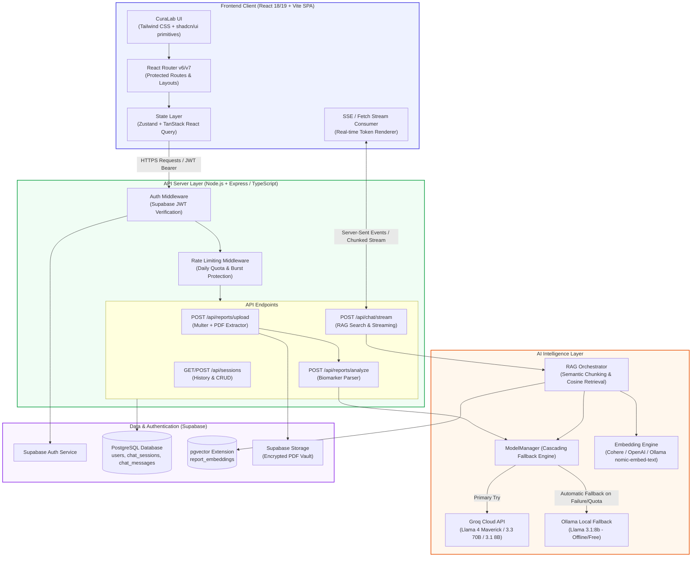
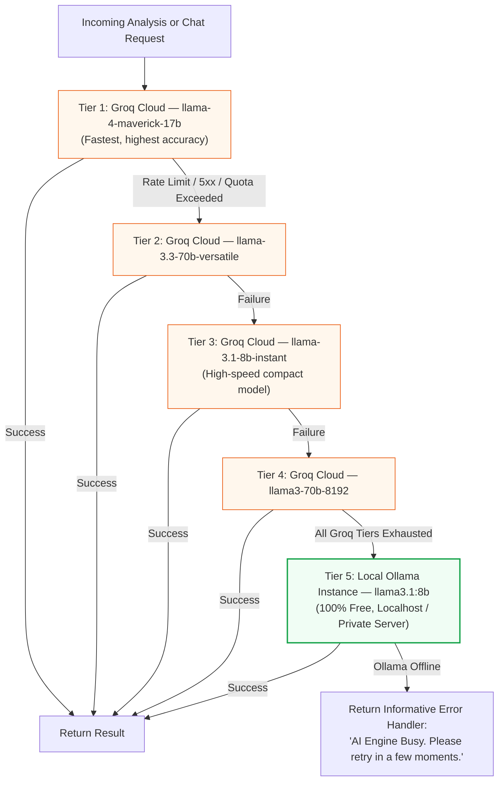
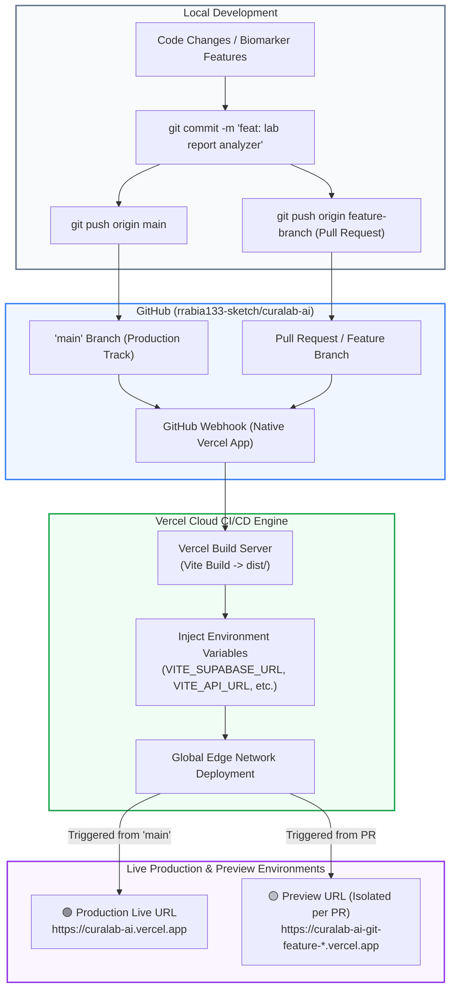

# CuraLab AI — System Architecture & Implementation Specification

**Platform Name:** **CuraLab AI** (Clinical Laboratory Intelligence & Biomarker Analytics Platform)  
**Architecture Model:** React.js (Vite SPA) + Node.js / Express API + Supabase (PostgreSQL & pgvector)  
**Status:** Production-Ready Technical Specification  
**Version:** 2.0.0  
**Author:** AI Engineering & Systems Architecture Team  

---

## Executive Summary

**CuraLab AI** is an intelligent clinical laboratory data analytics and biomarker interpretation platform. The system ingests medical laboratory reports (PDF format), validates report integrity, extracts structured biomarker panels (e.g., Hemoglobin, Fasting Blood Sugar, Lipid Profiles, Metabolic Panels), computes clinical status classifications (Normal, Low, High), and provides an interactive, retrieval-augmented (RAG) conversational agent for patient education and doctor-discussion preparation.

The platform is engineered with a decoupled architecture:
* **Client Tier:** High-performance React.js Single Page Application (SPA) powered by Vite, Tailwind CSS, shadcn/ui primitives, and TanStack Query.
* **API & AI Tier:** Secure Node.js / Express backend orchestrating multi-tiered LLM cascades (Groq Cloud primary with automatic fallback to local Ollama) and vector embeddings.
* **Data Tier:** Supabase PostgreSQL with `pgvector` for semantic document chunk indexing and row-level security (RLS).

---

## Table of Contents

1. [Brand Identity](#1-brand-identity)
2. [System Architecture Diagram](#2-system-architecture-diagram)
3. [Technology Stack](#3-technology-stack)
4. [Frontend Component & Routing Hierarchy (React + Vite)](#4-frontend-component--routing-hierarchy-react--vite)
5. [Backend API Specification (Node.js / Express)](#5-backend-api-specification-nodejs--express)
6. [AI Orchestration: Groq Cascade & Ollama Local Fallback](#6-ai-orchestration-groq-cascade--ollama-local-fallback)
7. [RAG Pipeline & pgvector Vector Storage](#7-rag-pipeline--pgvector-vector-storage)
8. [Database Schema (Supabase PostgreSQL + pgvector)](#8-database-schema-supabase-postgresql--pgvector)
9. [Client-Side Real-Time Streaming Architecture](#9-client-side-real-time-streaming-architecture)
10. [Project Directory & File Structure](#10-project-directory--file-structure)
11. [Environment Configuration](#11-environment-configuration)
12. [Step-by-Step Implementation Roadmap](#12-step-by-step-implementation-roadmap)
13. [Deployment & CI/CD Pipeline (GitHub to Vercel)](#13-deployment--cicd-pipeline-github-to-vercel)
14. [Clinical Safety & Compliance Disclaimers](#14-clinical-safety--compliance-disclaimers)

---

## 1. Brand Identity

* **Platform Name:** **CuraLab AI** *(Derived from Latin "Cura" = Care, Treatment, Guardian + Laboratory)*
* **Tagline:** *Clinical Biomarker Intelligence & Laboratory Analytics Platform*
* **Core Value Proposition:** Fast, secure, AI-assisted laboratory report analysis, structured health metrics visualization, and context-aware conversational follow-up.
* **Alternative Professional Designations:**
  * **VitalsIQ Analytics** — Diagnostic Data Intelligence
  * **PathoLens AI** — Precision Lab & Pathology Insights
  * **HemoInsight AI** — Hematology & Biochemical Analysis Engine
  * **BioMetrics Studio** — Intelligent Health Report Interpretation

---

## 2. System Architecture Diagram



---

## 3. Technology Stack

### Frontend (Client-Side SPA)
* **Core Framework:** React 18 / 19 with TypeScript
* **Build Engine:** Vite (ESBuild / Rollup)
* **Routing:** React Router DOM (v6.22+ or v7)
* **Styling & Design System:** Tailwind CSS v3.4+ + shadcn/ui components (Radix UI primitives)
* **Icons & Visuals:** Lucide React, Framer Motion (micro-animations), Recharts (biomarker trend graphs)
* **State & Server Cache:** TanStack Query v5 (`@tanstack/react-query`) + Zustand (session & global UI state)
* **Client-Side Validation:** Zod + React Hook Form
* **Authentication Client:** `@supabase/supabase-js`

### Backend (Server-Side API)
* **Runtime:** Node.js (v20+ LTS)
* **Server Framework:** Express.js with TypeScript (`tsx` / `ts-node-dev`)
* **Security & Utility:** `cors`, `helmet`, `dotenv`, `cookie-parser`, `express-rate-limit`
* **PDF Extraction & Validation:** `unpdf` / `pdf-parse` + `file-type` (magic bytes validation) + `multer` (in-memory buffer handling)
* **AI SDKs:** `groq-sdk` (official high-speed client), LangChain.js (`langchain`, `@langchain/community`)
* **Database Client:** `@supabase/supabase-js` with `SUPABASE_SERVICE_ROLE_KEY`

---

## 4. Frontend Component & Routing Hierarchy (React + Vite)

### Route Architecture (`src/App.tsx`)

```
/ (Public Landing / Redirect)
├── /login (Public Auth)
├── /signup (Public Auth)
└── /app (Protected Layout with AppSidebar & Navigation Header)
    ├── /app/dashboard (Sessions Overview, Health Trends, Upload Launcher)
    ├── /app/reports/new (Upload & PDF Extraction Dropzone)
    ├── /app/reports/:sessionId (Structured Biomarker Analysis Dashboard)
    └── /app/reports/:sessionId/chat (Interactive RAG Follow-Up Chat)
```

### Component Breakdown

```
src/
├── components/
│   ├── layout/
│   │   ├── AppHeader.tsx               # User profile, theme toggle, daily quota badge
│   │   ├── AppSidebar.tsx              # Session history, search filter, new analysis button
│   │   ├── ProtectedRoute.tsx          # Auth state guard with redirect logic
│   │   └── MedicalDisclaimerModal.tsx  # Non-dismissible clinical advisory modal
│   ├── analysis/
│   │   ├── BiomarkerCard.tsx           # Individual metric card (Normal/Low/High badge + reference range)
│   │   ├── BiomarkerSummaryTable.tsx   # Filterable table of all detected lab metrics
│   │   ├── HealthImplicationsPanel.tsx # Clinical summary in plain language
│   │   ├── DoctorQuestionsCard.tsx     # Copyable bullet points for doctor visits
│   │   └── ExportPdfButton.tsx         # Download clean clinical summary as PDF
│   ├── chat/
│   │   ├── ChatContainer.tsx           # Main chat viewport with auto-scroll
│   │   ├── ChatMessageBubble.tsx       # Markdown-rendered message with citations
│   │   ├── ChatInputBox.tsx            # Multi-line input with quick prompts
│   │   └── SourceCitationDrawer.tsx    # Slide-over showing exact PDF snippets used by RAG
│   ├── upload/
│   │   ├── DropzoneUploader.tsx        # Drag-and-drop zone with MIME and size checking
│   │   ├── ParsingProgress.tsx         # Animated multi-step progress bar (Upload -> OCR -> Extraction)
│   │   └── SampleReportPicker.tsx      # One-click demo reports (e.g. CBC, Lipid Panel)
│   └── ui/                             # shadcn/ui library (buttons, dialogs, badges, cards, tabs)
```

---

## 5. Backend API Specification (Node.js / Express)

All routes require a valid Supabase JWT Bearer token passed in the `Authorization` header, validated by `authMiddleware.ts`.

### 1. `POST /api/reports/upload-and-analyze`
* **Content-Type:** `multipart/form-data`
* **Payload:** `file` (PDF file, max 20MB, max 50 pages) + optional `patientContext` JSON.
* **Process Flow:**
  1. Inspects file buffer magic bytes via `file-type` (`application/pdf`).
  2. Extracts text using `unpdf`.
  3. Verifies medical report heuristics (searches for standard biomarker headers).
  4. Checks daily analysis quota for the user in Supabase (`DAILY_ANALYSIS_LIMIT = 15`).
  5. Passes text to `ModelManager` (Groq cascade with Ollama fallback).
  6. Computes vector embeddings in background and stores in `report_embeddings`.
  7. Persists session and analysis JSON to `chat_sessions`.
* **Response:** `{ sessionId: "uuid", reportTitle: string, analysis: BiomarkerAnalysisResponse }`

### 2. `POST /api/chat/stream`
* **Content-Type:** `application/json`
* **Payload:** `{ sessionId: "uuid", message: string }`
* **Response:** **Server-Sent Events (`text/event-stream`)** streaming AI response tokens with chunk citations.

### 3. `GET /api/sessions` & `GET /api/sessions/:id`
* Retrieves past analysis history, biomarker scores, and chat transcripts.

### 4. `DELETE /api/sessions/:id`
* Deletes session, associated messages, and vector embeddings in `pgvector` via database cascade.

### 5. `GET /api/user/quota`
* Returns `{ usedToday: number, limit: 15, resetAt: "ISOString" }`.

---

## 6. AI Orchestration: Groq Cascade & Ollama Local Fallback

The backend implements a multi-tiered fallback architecture to ensure high availability and zero service interruptions:



### TypeScript ModelManager Implementation

```typescript
// server/src/ai/ModelManager.ts
import Groq from "groq-sdk";

export interface ChatMessage {
  role: "system" | "user" | "assistant";
  content: string;
}

export interface ModelCompletionResult {
  content: string;
  provider: "groq" | "ollama";
  modelUsed: string;
}

export class ModelManager {
  private groqClient: Groq | null = null;
  private groqModels = [
    "meta-llama/llama-4-maverick-17b-128e-instruct",
    "llama-3.3-70b-versatile",
    "llama-3.1-8b-instant",
    "llama3-70b-8192",
  ];
  private ollamaBaseUrl: string;
  private ollamaModel: string;
  private enableOllama: boolean;

  constructor() {
    if (process.env.GROQ_API_KEY) {
      this.groqClient = new Groq({ apiKey: process.env.GROQ_API_KEY });
    }
    this.ollamaBaseUrl = process.env.OLLAMA_BASE_URL || "http://localhost:11434";
    this.ollamaModel = process.env.OLLAMA_MODEL || "llama3.1:8b";
    this.enableOllama = process.env.ENABLE_OLLAMA_FALLBACK !== "false";
  }

  public async complete(
    messages: ChatMessage[],
    temperature = 0.2
  ): Promise<ModelCompletionResult> {
    // 1. Attempt Groq Cascade
    if (this.groqClient) {
      for (const model of this.groqModels) {
        try {
          const res = await this.groqClient.chat.completions.create({
            model,
            messages,
            temperature,
          });
          const content = res.choices[0]?.message?.content;
          if (content) {
            return { content, provider: "groq", modelUsed: model };
          }
        } catch (err: any) {
          console.warn(`[ModelManager] Groq model ${model} failed: ${err.message}. Cascading...`);
        }
      }
    }

    // 2. Fallback to Local Ollama
    if (this.enableOllama) {
      try {
        console.log(`[ModelManager] Switching to Local Ollama (${this.ollamaModel})...`);
        const response = await fetch(`${this.ollamaBaseUrl}/api/chat`, {
          method: "POST",
          headers: { "Content-Type": "application/json" },
          body: JSON.stringify({
            model: this.ollamaModel,
            messages,
            stream: false,
            options: { temperature },
          }),
        });

        if (!response.ok) {
          throw new Error(`Ollama responded with status ${response.status}`);
        }

        const data: any = await response.json();
        return {
          content: data.message?.content || "",
          provider: "ollama",
          modelUsed: this.ollamaModel,
        };
      } catch (ollamaErr: any) {
        console.error(`[ModelManager] Ollama fallback failed: ${ollamaErr.message}`);
      }
    }

    throw new Error("All AI providers (Groq Cascade & Ollama Fallback) failed to respond.");
  }
}
```

---

## 7. RAG Pipeline & pgvector Vector Storage

1. **Chunking:** When a report is uploaded, `RecursiveCharacterTextSplitter` divides the raw medical text into semantically coherent overlapping segments (~500 characters with 80-character overlap).
2. **Embedding Generation:** Embeddings are generated using Cohere (`embed-english-v3.0`), OpenAI (`text-embedding-3-small`), or local Ollama (`nomic-embed-text`).
3. **Storage in Supabase pgvector:** Chunks and their 384 or 1536-dimensional vectors are stored in `report_embeddings` table with foreign key linkage to `chat_sessions.id`.
4. **Vector Retrieval:** During user follow-up questions, the query is embedded, and an IVFFlat cosine similarity query fetches the top 4 most relevant text chunks.
5. **Prompt Injection:** Context is securely injected into the system prompt with strict boundary instructions to prevent hallucination.

---

## 8. Database Schema (Supabase PostgreSQL + pgvector)

Run the following SQL in the Supabase SQL Editor:

```sql
-- 1. Enable pgvector extension
create extension if not exists vector;

-- 2. Chat Sessions Table (Stores Report & Analysis)
create table if not exists chat_sessions (
  id uuid primary key default gen_random_uuid(),
  user_id uuid references auth.users(id) on delete cascade not null,
  report_title text default 'Clinical Laboratory Report',
  report_text text not null,
  patient_context jsonb default '{}'::jsonb,
  analysis_result jsonb,
  status text default 'completed' check (status in ('processing', 'completed', 'failed')),
  created_at timestamptz default now()
);

-- 3. Chat Messages Table (Stores Conversation History)
create table if not exists chat_messages (
  id uuid primary key default gen_random_uuid(),
  session_id uuid references chat_sessions(id) on delete cascade not null,
  role text not null check (role in ('user', 'assistant', 'system')),
  content text not null,
  metadata jsonb default '{}'::jsonb,
  created_at timestamptz default now()
);

-- 4. Vector Embeddings Table for Semantic Document Search (RAG)
create table if not exists report_embeddings (
  id uuid primary key default gen_random_uuid(),
  session_id uuid references chat_sessions(id) on delete cascade not null,
  chunk_text text not null,
  chunk_index int not null,
  embedding vector(384), -- Match dimension of embedding model (e.g. 384 for nomic/MiniLM, 1536 for OpenAI)
  created_at timestamptz default now()
);

-- 5. Create Cosine Similarity Index
create index if not exists report_embeddings_cosine_idx 
on report_embeddings using ivfflat (embedding vector_cosine_ops)
with (lists = 100);

-- 6. Row Level Security (RLS) Policies
alter table chat_sessions enable row level security;
alter table chat_messages enable row level security;
alter table report_embeddings enable row level security;

-- Users can only access their own sessions
create policy "Users can view own sessions"
on chat_sessions for select using (auth.uid() = user_id);

create policy "Users can insert own sessions"
on chat_sessions for insert with check (auth.uid() = user_id);

create policy "Users can delete own sessions"
on chat_sessions for delete using (auth.uid() = user_id);

-- Messages policy via session relationship
create policy "Users can manage messages in their sessions"
on chat_messages for all using (
  exists (
    select 1 from chat_sessions
    where chat_sessions.id = chat_messages.session_id
    and chat_sessions.user_id = auth.uid()
  )
);

-- Embeddings policy via session relationship
create policy "Users can manage embeddings in their sessions"
on report_embeddings for all using (
  exists (
    select 1 from chat_sessions
    where chat_sessions.id = report_embeddings.session_id
    and chat_sessions.user_id = auth.uid()
  )
);
```

---

## 9. Client-Side Real-Time Streaming Architecture

In pure React.js, real-time token streaming from the Node.js API is implemented using standard `fetch` with `ReadableStream` reader:

```typescript
// client/src/hooks/useChatStream.ts
import { useState, useCallback } from "react";

export function useChatStream(sessionId: string) {
  const [messages, setMessages] = useState<Array<{ role: string; content: string }>>([]);
  const [isStreaming, setIsStreaming] = useState(false);

  const sendMessage = useCallback(async (userPrompt: string, token: string) => {
    setIsStreaming(true);
    setMessages((prev) => [...prev, { role: "user", content: userPrompt }]);
    
    // Add temporary assistant placeholder
    setMessages((prev) => [...prev, { role: "assistant", content: "" }]);

    try {
      const response = await fetch(`${import.meta.env.VITE_API_URL}/api/chat/stream`, {
        method: "POST",
        headers: {
          "Content-Type": "application/json",
          Authorization: `Bearer ${token}`,
        },
        body: JSON.stringify({ sessionId, message: userPrompt }),
      });

      if (!response.body) throw new Error("No response body available");

      const reader = response.body.getReader();
      const decoder = new TextDecoder("utf-8");
      let accumulated = "";

      while (true) {
        const { done, value } = await reader.read();
        if (done) break;

        const chunk = decoder.decode(value, { stream: true });
        accumulated += chunk;

        setMessages((prev) => {
          const updated = [...prev];
          updated[updated.length - 1] = { role: "assistant", content: accumulated };
          return updated;
        });
      }
    } catch (error) {
      console.error("Streaming error:", error);
    } finally {
      setIsStreaming(false);
    }
  }, [sessionId]);

  return { messages, isStreaming, sendMessage };
}
```

---

## 10. Project Directory & File Structure

```
curalab-ai/
├── client/                                 # React.js (Vite Frontend SPA)
│   ├── public/
│   │   ├── favicon.svg
│   │   └── sample-reports/                 # Demo PDFs (CBC, Metabolic Panel)
│   ├── src/
│   │   ├── assets/
│   │   ├── components/
│   │   │   ├── analysis/
│   │   │   │   ├── BiomarkerCard.tsx
│   │   │   │   ├── BiomarkerSummaryTable.tsx
│   │   │   │   ├── HealthImplicationsPanel.tsx
│   │   │   │   └── DoctorQuestionsCard.tsx
│   │   │   ├── chat/
│   │   │   │   ├── ChatContainer.tsx
│   │   │   │   ├── ChatMessageBubble.tsx
│   │   │   │   └── ChatInputBox.tsx
│   │   │   ├── layout/
│   │   │   │   ├── AppHeader.tsx
│   │   │   │   ├── AppSidebar.tsx
│   │   │   │   ├── ProtectedRoute.tsx
│   │   │   │   └── MedicalDisclaimerModal.tsx
│   │   │   ├── upload/
│   │   │   │   ├── DropzoneUploader.tsx
│   │   │   │   └── ParsingProgress.tsx
│   │   │   └── ui/                         # shadcn/ui components (button, card, dialog, etc.)
│   │   ├── hooks/
│   │   │   ├── useAuth.ts                  # Supabase session & user hook
│   │   │   ├── useChatStream.ts            # SSE / chunked streaming hook
│   │   │   └── useSessions.ts              # TanStack Query for session history
│   │   ├── lib/
│   │   │   ├── supabase.ts                 # Supabase client initialization
│   │   │   ├── api.ts                      # Axios/Fetch API client wrapper
│   │   │   └── utils.ts                    # Classnames & formatting helpers
│   │   ├── pages/
│   │   │   ├── LoginPage.tsx
│   │   │   ├── SignupPage.tsx
│   │   │   ├── DashboardPage.tsx
│   │   │   ├── ReportAnalysisPage.tsx
│   │   │   └── ReportChatPage.tsx
│   │   ├── stores/
│   │   │   └── useAppStore.ts              # Zustand global client state
│   │   ├── types/
│   │   │   └── index.ts                    # TypeScript biomarker & session types
│   │   ├── App.tsx                         # React Router layout definitions
│   │   ├── main.tsx                        # React DOM entry point
│   │   └── index.css                       # Tailwind CSS directives & theme variables
│   ├── index.html
│   ├── package.json
│   ├── tailwind.config.js
│   ├── tsconfig.json
│   └── vite.config.ts
│
├── server/                                 # Node.js + Express (API Backend)
│   ├── src/
│   │   ├── ai/
│   │   │   ├── ModelManager.ts             # Groq Cascade + Ollama Fallback
│   │   │   ├── AnalysisAgent.ts            # Structured Biomarker Extractor
│   │   │   ├── RagChatAgent.ts             # Cosine Vector Search & Streamer
│   │   │   └── prompts.ts                  # Clinical analysis prompt templates
│   │   ├── config/
│   │   │   └── env.ts                      # Validated environment variables (Zod)
│   │   ├── middleware/
│   │   │   ├── authMiddleware.ts           # Supabase JWT token verification
│   │   │   ├── rateLimiter.ts              # Daily analysis counter (15/day)
│   │   │   └── errorMiddleware.ts          # Global exception handler
│   │   ├── routes/
│   │   │   ├── reports.routes.ts           # Upload & analyze endpoints
│   │   │   ├── chat.routes.ts              # Streaming RAG chat endpoint
│   │   │   └── sessions.routes.ts          # History CRUD endpoints
│   │   ├── services/
│   │   │   ├── pdfExtractor.ts             # Unpdf text parser & page limiter
│   │   │   ├── embeddingService.ts         # Vector generation (Cohere / Ollama)
│   │   │   └── supabaseAdmin.ts            # Supabase service role client
│   │   ├── utils/
│   │   │   └── fileValidators.ts           # Magic byte MIME validator
│   │   └── index.ts                        # Express server entry point
│   ├── package.json
│   ├── tsconfig.json
│   └── .env.example
│
├── docs/                                   # Documentation & Schemas
│   ├── schema.sql                          # Database schema with pgvector
│   ├── CuraLab_React_Architecture.md       # (This Document)
│   └── API_SPECIFICATION.md
├── package.json                            # Root workspace scripts (concurrently dev)
└── README.md
```

---

## 11. Environment Configuration

### Client Environment (`client/.env`)
```bash
# Supabase Client Public Credentials
VITE_SUPABASE_URL=https://your-project.supabase.co
VITE_SUPABASE_ANON_KEY=eyJhbGciOi...

# Backend API URL
VITE_API_URL=http://localhost:5000
```

### Server Environment (`server/.env`)
```bash
# Server Port & Allowed Origins
PORT=5000
CLIENT_ORIGIN=http://localhost:5173

# Supabase Server-Side Admin Credentials
SUPABASE_URL=https://your-project.supabase.co
SUPABASE_SERVICE_ROLE_KEY=eyJhbGciOi...

# Primary Cloud LLM (Groq)
GROQ_API_KEY=gsk_your_groq_api_key_here

# Local Fallback LLM (Ollama)
ENABLE_OLLAMA_FALLBACK=true
OLLAMA_BASE_URL=http://localhost:11434
OLLAMA_MODEL=llama3.1:8b
OLLAMA_EMBED_MODEL=nomic-embed-text

# Embedding Configuration (Hosted vs. Local)
EMBEDDING_PROVIDER=cohere # Options: cohere | openai | ollama
EMBEDDING_API_KEY=your_cohere_or_openai_api_key

# Operational Limits
DAILY_ANALYSIS_LIMIT=15
MAX_UPLOAD_MB=20
MAX_PDF_PAGES=50
```

---

## 12. Step-by-Step Implementation Roadmap

```
Step 1 ────────► Step 2 ────────► Step 3 ────────► Step 4 ────────► Step 5
Client/Server    Supabase &       PDF Parsing &    Groq Cascade &   RAG Chat &
Scaffolding      pgvector Setup   Validations      Analysis Agent   Polish
```

1. **Step 1: Scaffolding**
   * Initialize `client` with `npm create vite@latest client -- --template react-ts`.
   * Initialize `server` with `npm init -y` and install Express + TypeScript tooling.
   * Configure Tailwind CSS and shadcn/ui components in `client`.
2. **Step 2: Supabase & Vector Storage**
   * Execute `schema.sql` in Supabase SQL editor to create `chat_sessions`, `chat_messages`, and `report_embeddings` with pgvector.
   * Wire `useAuth` hook in React using `@supabase/supabase-js`.
3. **Step 3: PDF Processing Engine**
   * Build `DropzoneUploader.tsx` in React with multi-step parsing indicator.
   * Implement `pdfExtractor.ts` on server using `unpdf` and `file-type` magic bytes.
4. **Step 4: AI Analysis Pipeline**
   * Implement `ModelManager.ts` (Groq 4-model cascade with fallback to local Ollama).
   * Create structured JSON biomarker extraction prompts in `prompts.ts`.
   * Build `BiomarkerSummaryTable.tsx` and `BiomarkerCard.tsx` in React.
5. **Step 5: RAG Follow-up Chat & Streaming**
   * Implement text chunking and cosine vector similarity search.
   * Implement real-time token streaming with `ReadableStream` on React client.
   * Add prominent non-dismissible clinical disclaimers.

---

## 13. Deployment & CI/CD Pipeline (GitHub to Vercel Integration)

### Native Git-Push Deployment Architecture

CuraLab AI uses **Vercel's Native GitHub Integration** for zero-friction continuous deployment. Once the GitHub repository is connected to Vercel via the Vercel GitHub App, every push to the repository automatically triggers an optimized cloud build and instant global edge deployment.



---

### Step-by-Step: Connecting GitHub to Vercel

```
Step 1 ────────────────► Step 2 ────────────────► Step 3 ────────────────► Step 4
Go to Vercel &           Import Repo              Configure Root &         Push to 'main'
Install GitHub App       'curalab-ai'             Environment Variables    Auto-Deploy!
```

#### Step 1: Install Vercel GitHub App & Connect Account
1. Log in to [Vercel Dashboard](https://vercel.com).
2. Click **"Add New..."** ➔ **"Project"**.
3. Under *Import Git Repository*, select **GitHub**. If not yet connected, click **"Install Vercel for GitHub"** and grant access to your repository `rrabia133-sketch/curalab-ai`.

#### Step 2: Import the Repository
1. Locate `curalab-ai` in the list of repositories and click **"Import"**.

#### Step 3: Configure Project Settings on Vercel Dashboard
In the project configuration screen:
* **Framework Preset:** Select `Vite`.
* **Root Directory:** If the React application resides in `client`, click *Edit* and select `./client` (or leave `./` if at root).
* **Build Command:** `npm run build` (detected automatically).
* **Output Directory:** `dist` (detected automatically).
* **Install Command:** `npm install`.

#### Step 4: Add Environment Variables in Vercel
Expand the **Environment Variables** section on Vercel and add:

| Key | Value | Target Environment |
| :--- | :--- | :--- |
| `VITE_SUPABASE_URL` | `https://your-project.supabase.co` | Production, Preview, Development |
| `VITE_SUPABASE_ANON_KEY` | `eyJhbGciOi...` | Production, Preview, Development |
| `VITE_API_URL` | `https://your-backend-api.onrender.com` | Production, Preview, Development |

Click **"Deploy"**. Vercel will build and assign your initial production domain (e.g. `https://curalab-ai.vercel.app`).

---

### The Continuous Deployment Flow (Daily Workflow)

Once connected, no manual action on Vercel is ever needed:

1. **Deploying Updates to Production:**
   ```bash
   git add .
   git commit -m "feat: updated biomarker range indicators"
   git push origin main
   ```
   * *Vercel automatically detects the push to `main`, executes the build in seconds, and updates production with zero downtime.*

2. **Previewing Changes Before Merging:**
   ```bash
   git checkout -b feature/pdf-ocr-enhancement
   git commit -m "feat: improved OCR parsing speed"
   git push origin feature/pdf-ocr-enhancement
   ```
   * *When a Pull Request is opened on GitHub, Vercel automatically deploys a private Preview URL and comments on the PR with the link for instant visual QA testing.*

---

### Backend API Deployment (Node.js / Express)
* **Hosts:** Render, Railway, Fly.io, or AWS App Runner.
* **Continuous Deployment:** Connect the same GitHub repository (`rrabia133-sketch/curalab-ai`) with Root Directory set to `./server`.
* **Build Command:** `npm run build` -> `npm start` (Runs compiled `dist/index.js`).
* **Health Check Endpoint:** `GET /health` or `GET /api/user/quota`.

---

## 14. Clinical Safety & Compliance Disclaimers

Every report view and chat interface must render the following standard medical notice:

> **Important Clinical Notice:**  
> *CuraLab AI is an artificial intelligence-assisted educational and data interpretation platform. It does not provide medical diagnoses, treatment plans, or prescriptions. Always consult a qualified licensed physician or healthcare professional for clinical decisions regarding laboratory results.*

---

*Document compiled and verified for production React.js + Node.js architecture.*
