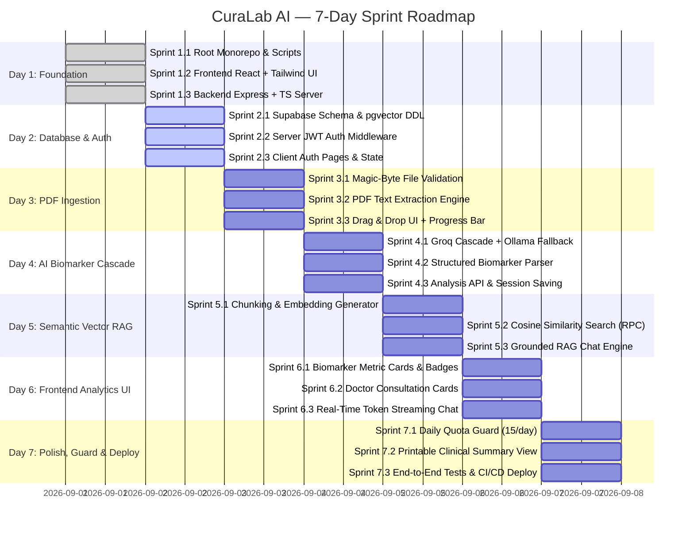

# 🩺 CuraLab AI — Easy-to-Understand Sprint-by-Sprint Implementation Plan

> **Platform:** CuraLab AI — Clinical Laboratory Intelligence & Biomarker Analytics Platform  
> **Architecture:** React (Vite + TypeScript + Tailwind CSS) + Node.js (Express + TypeScript) + Supabase (PostgreSQL + pgvector) + Groq Cloud (Llama 3.3/3.1) & Ollama Fallback  
> **Timeline:** 7-Day Structured Implementation (21 Micro-Sprints)  
> **Target Audience:** Developers of all levels (Clear concepts, complete copy-pasteable code, and verification steps)

---

## 🧭 Executive Visual Roadmap



---

## 🧠 Plain-English Glossary (Core Concepts)

| Term | What It Means (Simple Words) | Why It Matters In CuraLab |
| :--- | :--- | :--- |
| **Monorepo** | Storing both frontend (`client`) and backend (`server`) in a single repository. | One single `npm run dev` starts the entire full-stack app. |
| **JWT (JSON Web Token)** | A secure digital badge given to a user when they log in. | Backend verifies the badge on every request to ensure users only see their own health reports. |
| **Magic Bytes** | The first few bytes of a file that prove its true format. | Stops bad actors from renaming `.exe` to `.pdf` and uploading malware. |
| **LLM Cascade** | A tiered fallback system: try Groq Llama 3.3 first; if rate-limited, try Llama 3.1; if offline, fallback to local Ollama. | Gives the app 100% uptime with zero API failures. |
| **Vector Embeddings** | Converting sentences into numerical arrays (coordinates in meaning-space). | Enables searching for "high blood sugar" and retrieving "Fasting Glucose: 145 mg/dL". |
| **pgvector** | A PostgreSQL extension for high-speed vector similarity searches. | Matches patient questions to the exact paragraphs in their uploaded lab report. |
| **RAG (Retrieval-Augmented Generation)** | Providing retrieved lab report excerpts directly to the AI prompt. | Prevents AI hallucination and ensures 100% citation-backed answers. |
| **SSE (Server-Sent Events)** | Streaming tokens one-by-one from the server to the browser. | Renders live typing animations (like ChatGPT) instead of making users wait 10 seconds. |

---

# 🗓️ Day 1: Project Setup & Full-Stack Scaffolding

### 🎯 Day 1 Objective
Initialize the root workspace, create the React + Vite frontend with Tailwind CSS, create the Express + TypeScript backend, and verify that both communicate through a health check endpoint.

---

### 🔹 Sprint 1.1: Root Workspace & Monorepo Setup
**Goal:** Configure root `package.json` to orchestrate both client and server with a single terminal command.

1. **Initialize Root `package.json`**:
```json
{
  "name": "curalab-ai",
  "version": "1.0.0",
  "private": true,
  "scripts": {
    "dev": "concurrently \"npm run dev --prefix server\" \"npm run dev --prefix client\"",
    "build": "npm run build --prefix server && npm run build --prefix client",
    "install:all": "npm install && npm install --prefix client && npm install --prefix server"
  },
  "devDependencies": {
    "concurrently": "^8.2.2"
  }
}
```

2. **Install root dependencies**:
```bash
npm install
```

---

### 🔹 Sprint 1.2: Frontend React + Vite + Tailwind Setup
**Goal:** Create the `client` app with TypeScript, Tailwind CSS, Lucide icons, and routing.

1. **Scaffold React Client**:
```bash
npm create vite@latest client -- --template react-ts
cd client
npm install
```

2. **Install Frontend Dependencies**:
```bash
npm install @supabase/supabase-js @tanstack/react-query zustand lucide-react clsx tailwind-merge framer-motion recharts react-router-dom axios
npm install -D tailwindcss postcss autoprefixer @types/node
npx tailwindcss init -p
```

3. **Configure `client/tailwind.config.js`**:
```javascript
/** @type {import('tailwindcss').Config} */
export default {
  content: ["./index.html", "./src/**/*.{js,ts,jsx,tsx}"],
  theme: {
    extend: {
      colors: {
        brand: {
          50: "#eef2ff",
          100: "#e0e7ff",
          500: "#6366f1",
          600: "#4f46e5",
          700: "#4338ca",
        },
        clinical: {
          normal: "#10b981", // Emerald Green for normal range
          warning: "#f59e0b", // Amber for borderline
          danger: "#ef4444",  // Crimson Red for high/low out-of-range
        }
      }
    },
  },
  plugins: [],
}
```

4. **Add Base Styles `client/src/index.css`**:
```css
@tailwind base;
@tailwind components;
@tailwind utilities;

body {
  @apply bg-slate-50 text-slate-900 antialiased min-h-screen;
  font-family: -apple-system, BlinkMacSystemFont, "Segoe UI", Roboto, sans-serif;
}
```

5. **Create `client/.env.example`**:
```bash
VITE_SUPABASE_URL=https://your-project.supabase.co
VITE_SUPABASE_ANON_KEY=your-anon-key-here
VITE_API_URL=http://localhost:5000
```

---

### 🔹 Sprint 1.3: Backend Express + TypeScript Server
**Goal:** Create the `server` folder with strict TypeScript configuration, security middleware, and a health check route.

1. **Initialize Server**:
```bash
cd ..
mkdir server
cd server
npm init -y
```

2. **Install Backend Dependencies**:
```bash
npm install express cors dotenv helmet multer zod unpdf file-type @supabase/supabase-js groq-sdk
npm install -D typescript tsx @types/express @types/cors @types/multer @types/node
```

3. **Configure `server/tsconfig.json`**:
```json
{
  "compilerOptions": {
    "target": "ES2022",
    "module": "NodeNext",
    "moduleResolution": "NodeNext",
    "lib": ["ES2022"],
    "outDir": "./dist",
    "rootDir": "./src",
    "strict": true,
    "esModuleInterop": true,
    "skipLibCheck": true,
    "forceConsistentCasingInFileNames": true
  },
  "include": ["src/**/*"]
}
```

4. **Create Server Entry Point `server/src/index.ts`**:
```typescript
import express, { Request, Response } from "express";
import cors from "cors";
import helmet from "helmet";
import dotenv from "dotenv";

dotenv.config();

const app = express();
const PORT = process.env.PORT || 5000;
const CLIENT_ORIGIN = process.env.CLIENT_ORIGIN || "http://localhost:5173";

app.use(helmet());
app.use(cors({ origin: CLIENT_ORIGIN, credentials: true }));
app.use(express.json({ limit: "10mb" }));

// Health Check
app.get("/health", (_req: Request, res: Response) => {
  res.json({
    status: "healthy",
    service: "CuraLab AI API Server",
    timestamp: new Date().toISOString(),
  });
});

app.listen(PORT, () => {
  console.log(`🚀 CuraLab Server listening on http://localhost:${PORT}`);
});
```

5. **Update `server/package.json` Scripts**:
```json
{
  "scripts": {
    "dev": "tsx watch src/index.ts",
    "build": "tsc",
    "start": "node dist/index.js"
  }
}
```

6. **Create `server/.env.example`**:
```bash
PORT=5000
CLIENT_ORIGIN=http://localhost:5173
SUPABASE_URL=https://your-project.supabase.co
SUPABASE_SERVICE_ROLE_KEY=your-service-role-key-here
GROQ_API_KEY=gsk_your_groq_api_key_here
ENABLE_OLLAMA_FALLBACK=true
OLLAMA_BASE_URL=http://localhost:11434
OLLAMA_MODEL=llama3.1:8b
DAILY_ANALYSIS_LIMIT=15
```

---

### 🧪 Day 1 Verification Checklist
- [ ] Run `npm run dev` from root folder: Both React (port 5173) and Express (port 5000) start concurrently.
- [ ] Open `http://localhost:5000/health`: JSON responds with `{"status":"healthy"}`.
- [ ] Open `http://localhost:5173`: React app loads with Tailwind CSS styling active.

---

# 🗓️ Day 2: Supabase Database & User Authentication

### 🎯 Day 2 Objective
Deploy the PostgreSQL schema with `pgvector` in Supabase, implement backend JWT authentication middleware, and build the React login/signup interface.

---

### 🔹 Sprint 2.1: Supabase Database Schema & Vector Extension
**Goal:** Create PostgreSQL tables for session history, messages, and vector embeddings with Row-Level Security (RLS).

Run in the **Supabase SQL Editor**:
```sql
-- 1. Enable pgvector for semantic search
create extension if not exists vector;

-- 2. Chat Sessions Table (Stores uploaded report and structured biomarker analysis)
create table if not exists chat_sessions (
  id uuid primary key default gen_random_uuid(),
  user_id uuid references auth.users(id) on delete cascade not null,
  report_title text default 'Clinical Laboratory Report',
  report_text text not null,
  patient_context jsonb default '{}'::jsonb,
  analysis_result jsonb,
  status text default 'completed' check (status in ('processing', 'completed', 'failed')),
  created_at timestamptz default now()
);

-- 3. Chat Messages Table (Stores conversational Q&A)
create table if not exists chat_messages (
  id uuid primary key default gen_random_uuid(),
  session_id uuid references chat_sessions(id) on delete cascade not null,
  role text not null check (role in ('user', 'assistant', 'system')),
  content text not null,
  metadata jsonb default '{}'::jsonb,
  created_at timestamptz default now()
);

-- 4. Embeddings Table (Stores 384-dimensional vectors for RAG)
create table if not exists report_embeddings (
  id uuid primary key default gen_random_uuid(),
  session_id uuid references chat_sessions(id) on delete cascade not null,
  chunk_text text not null,
  chunk_index int not null,
  embedding vector(384),
  created_at timestamptz default now()
);

-- 5. Row-Level Security (RLS)
alter table chat_sessions enable row level security;
alter table chat_messages enable row level security;
alter table report_embeddings enable row level security;

-- 6. RLS Policies
create policy "Users manage their own sessions"
on chat_sessions for all using (auth.uid() = user_id);

create policy "Users manage messages in their sessions"
on chat_messages for all using (
  exists (
    select 1 from chat_sessions
    where chat_sessions.id = chat_messages.session_id
    and chat_sessions.user_id = auth.uid()
  )
);

create policy "Users manage embeddings in their sessions"
on report_embeddings for all using (
  exists (
    select 1 from chat_sessions
    where chat_sessions.id = report_embeddings.session_id
    and chat_sessions.user_id = auth.uid()
  )
);

-- 7. Cosine Search Stored Procedure (RPC)
create or replace function match_report_chunks(
  query_embedding vector(384),
  match_session_id uuid,
  match_count int default 4
)
returns table (
  id uuid,
  chunk_text text,
  similarity float
)
language plpgsql
as $$
begin
  return query
  select
    report_embeddings.id,
    report_embeddings.chunk_text,
    1 - (report_embeddings.embedding <=> query_embedding) as similarity
  from report_embeddings
  where report_embeddings.session_id = match_session_id
  order by report_embeddings.embedding <=> query_embedding
  limit match_count;
end;
$$;
```

---

### 🔹 Sprint 2.2: Backend JWT Authentication Middleware
**Goal:** Validate Supabase Bearer tokens on protected API endpoints.

1. **Create `server/src/services/supabaseAdmin.ts`**:
```typescript
import { createClient } from "@supabase/supabase-js";
import dotenv from "dotenv";

dotenv.config();

const supabaseUrl = process.env.SUPABASE_URL || "";
const supabaseServiceKey = process.env.SUPABASE_SERVICE_ROLE_KEY || "";

if (!supabaseUrl || !supabaseServiceKey) {
  console.warn("⚠️ Supabase credentials missing in server .env");
}

export const supabaseAdmin = createClient(supabaseUrl, supabaseServiceKey);
```

2. **Create `server/src/middleware/authMiddleware.ts`**:
```typescript
import { Request, Response, NextFunction } from "express";
import { supabaseAdmin } from "../services/supabaseAdmin.js";

export interface AuthenticatedRequest extends Request {
  user?: {
    id: string;
    email?: string;
  };
}

export async function requireAuth(
  req: AuthenticatedRequest,
  res: Response,
  next: NextFunction
): Promise<void> {
  const authHeader = req.headers.authorization;

  if (!authHeader || !authHeader.startsWith("Bearer ")) {
    res.status(401).json({ error: "Missing or invalid authorization header" });
    return;
  }

  const token = authHeader.split(" ")[1];

  try {
    const { data: { user }, error } = await supabaseAdmin.auth.getUser(token);

    if (error || !user) {
      res.status(401).json({ error: "Unauthorized: Invalid or expired token" });
      return;
    }

    req.user = { id: user.id, email: user.email };
    next();
  } catch (err: any) {
    res.status(500).json({ error: "Authentication verification failed", details: err.message });
  }
}
```

---

### 🔹 Sprint 2.3: Frontend Supabase Client & Auth State
**Goal:** Setup Supabase client in React with Zustand store and Login/Signup forms.

1. **Create `client/src/lib/supabase.ts`**:
```typescript
import { createClient } from "@supabase/supabase-js";

const supabaseUrl = import.meta.env.VITE_SUPABASE_URL;
const supabaseAnonKey = import.meta.env.VITE_SUPABASE_ANON_KEY;

if (!supabaseUrl || !supabaseAnonKey) {
  console.error("Missing Supabase environment variables in client/.env");
}

export const supabase = createClient(supabaseUrl, supabaseAnonKey);
```

2. **Create Auth Store `client/src/stores/authStore.ts`**:
```typescript
import { create } from "zustand";
import { User, Session } from "@supabase/supabase-js";
import { supabase } from "../lib/supabase";

interface AuthState {
  user: User | null;
  session: Session | null;
  loading: boolean;
  setUser: (user: User | null) => void;
  setSession: (session: Session | null) => void;
  initialize: () => Promise<void>;
  signOut: () => Promise<void>;
}

export const useAuthStore = create<AuthState>((set) => ({
  user: null,
  session: null,
  loading: true,
  setUser: (user) => set({ user }),
  setSession: (session) => set({ session }),
  initialize: async () => {
    const { data: { session } } = await supabase.auth.getSession();
    set({ session, user: session?.user || null, loading: false });

    supabase.auth.onAuthStateChange((_event, session) => {
      set({ session, user: session?.user || null, loading: false });
    });
  },
  signOut: async () => {
    await supabase.auth.signOut();
    set({ user: null, session: null });
  },
}));
```

3. **Create Auth Page `client/src/pages/AuthPage.tsx`**:
```tsx
import React, { useState } from "react";
import { supabase } from "../lib/supabase";
import { Activity, ShieldCheck, Mail, Lock, Loader2 } from "lucide-react";

export const AuthPage: React.FC = () => {
  const [isSignUp, setIsSignUp] = useState(false);
  const [email, setEmail] = useState("");
  const [password, setPassword] = useState("");
  const [loading, setLoading] = useState(false);
  const [errorMsg, setErrorMsg] = useState("");

  const handleAuth = async (e: React.FormEvent) => {
    e.preventDefault();
    setLoading(true);
    setErrorMsg("");

    try {
      if (isSignUp) {
        const { error } = await supabase.auth.signUp({ email, password });
        if (error) throw error;
        alert("Account created! Check your email for confirmation or log in.");
      } else {
        const { error } = await supabase.auth.signInWithPassword({ email, password });
        if (error) throw error;
      }
    } catch (err: any) {
      setErrorMsg(err.message || "Authentication error occurred");
    } finally {
      setLoading(false);
    }
  };

  return (
    <div className="min-h-screen bg-gradient-to-br from-indigo-50 via-white to-blue-50 flex items-center justify-center p-4">
      <div className="max-w-md w-full bg-white rounded-2xl shadow-xl border border-slate-100 p-8">
        <div className="flex items-center justify-center gap-2 mb-6">
          <div className="p-3 bg-indigo-600 rounded-xl text-white">
            <Activity className="w-7 h-7" />
          </div>
          <span className="text-2xl font-bold bg-clip-text text-transparent bg-gradient-to-r from-indigo-600 to-blue-600">
            CuraLab AI
          </span>
        </div>

        <h2 className="text-xl font-bold text-slate-800 text-center mb-2">
          {isSignUp ? "Create your health portal" : "Welcome back"}
        </h2>
        <p className="text-sm text-slate-500 text-center mb-6">
          Clinical Laboratory Intelligence & Biomarker Analytics
        </p>

        {errorMsg && (
          <div className="mb-4 p-3 bg-red-50 border border-red-200 text-red-700 text-sm rounded-lg">
            {errorMsg}
          </div>
        )}

        <form onSubmit={handleAuth} className="space-y-4">
          <div>
            <label className="block text-xs font-semibold text-slate-600 uppercase mb-1">Email</label>
            <div className="relative">
              <Mail className="w-5 h-5 text-slate-400 absolute left-3 top-3" />
              <input
                type="email"
                required
                value={email}
                onChange={(e) => setEmail(e.target.value)}
                placeholder="doctor@hospital.org"
                className="w-full pl-10 pr-4 py-2.5 bg-slate-50 border border-slate-200 rounded-lg text-sm focus:outline-none focus:ring-2 focus:ring-indigo-500"
              />
            </div>
          </div>

          <div>
            <label className="block text-xs font-semibold text-slate-600 uppercase mb-1">Password</label>
            <div className="relative">
              <Lock className="w-5 h-5 text-slate-400 absolute left-3 top-3" />
              <input
                type="password"
                required
                value={password}
                onChange={(e) => setPassword(e.target.value)}
                placeholder="••••••••"
                className="w-full pl-10 pr-4 py-2.5 bg-slate-50 border border-slate-200 rounded-lg text-sm focus:outline-none focus:ring-2 focus:ring-indigo-500"
              />
            </div>
          </div>

          <button
            type="submit"
            disabled={loading}
            className="w-full py-3 bg-indigo-600 hover:bg-indigo-700 text-white font-medium rounded-lg text-sm transition flex items-center justify-center gap-2 shadow-md shadow-indigo-100 disabled:opacity-50"
          >
            {loading ? <Loader2 className="w-5 h-5 animate-spin" /> : (isSignUp ? "Sign Up" : "Sign In")}
          </button>
        </form>

        <div className="mt-6 text-center">
          <button
            onClick={() => setIsSignUp(!isSignUp)}
            className="text-sm text-indigo-600 hover:underline font-medium"
          >
            {isSignUp ? "Already have an account? Sign In" : "Don't have an account? Create one"}
          </button>
        </div>

        <div className="mt-6 pt-4 border-t border-slate-100 flex items-center justify-center gap-2 text-xs text-slate-400">
          <ShieldCheck className="w-4 h-4 text-emerald-500" />
          <span>Encrypted with PostgreSQL Row-Level Security</span>
        </div>
      </div>
    </div>
  );
};
```

---

### 🧪 Day 2 Verification Checklist
- [ ] Run `schema.sql` in Supabase SQL editor: `chat_sessions`, `chat_messages`, and `report_embeddings` are created with RLS enabled.
- [ ] Sign up a new user via React Auth Page: User appears in Supabase Auth Dashboard.
- [ ] Test Protected Endpoint: Sending a request with an invalid Bearer token returns `401 Unauthorized`.

---

# 🗓️ Day 3: Secure PDF Ingestion & Text Extraction

### 🎯 Day 3 Objective
Implement file upload with magic-bytes MIME validation, extract raw text from medical PDF lab reports using `unpdf`, and create a responsive drag-and-drop upload zone in React.

---

### 🔹 Sprint 3.1: Magic-Byte File Validation Middleware
**Goal:** Verify file authenticity in-memory so malicious files are rejected before processing.

Create `server/src/middleware/fileValidator.ts`:
```typescript
import { Request, Response, NextFunction } from "express";
import { fileTypeFromBuffer } from "file-type";

export async function validatePdfFile(
  req: Request,
  res: Response,
  next: NextFunction
): Promise<void> {
  if (!req.file) {
    res.status(400).json({ error: "No file uploaded" });
    return;
  }

  // 1. Check file size (20MB limit)
  const MAX_SIZE = 20 * 1024 * 1024;
  if (req.file.size > MAX_SIZE) {
    res.status(400).json({ error: "File exceeds 20MB limit" });
    return;
  }

  // 2. Validate magic bytes (%PDF-)
  const fileType = await fileTypeFromBuffer(req.file.buffer);
  if (!fileType || fileType.mime !== "application/pdf") {
    res.status(400).json({ error: "Invalid file type. Only genuine PDF documents are supported." });
    return;
  }

  next();
}
```

---

### 🔹 Sprint 3.2: PDF Text Extraction Service
**Goal:** Extract clean text content and page counts from uploaded PDF buffers.

Create `server/src/services/pdfService.ts`:
```typescript
import { extractText, getDocumentProxy } from "unpdf";

export interface ParsedPdfResult {
  text: string;
  totalPages: number;
  info?: Record<string, any>;
}

export async function parsePdfBuffer(buffer: Buffer): Promise<ParsedPdfResult> {
  try {
    const uint8Array = new Uint8Array(buffer);
    const pdf = await getDocumentProxy(uint8Array);
    const totalPages = pdf.numPages;

    if (totalPages > 50) {
      throw new Error(`PDF exceeds max page limit (50 pages). Document has ${totalPages} pages.`);
    }

    const { text } = await extractText(uint8Array, { mergePages: true });

    const sanitizedText = text
      .replace(/\r\n/g, "\n")
      .replace(/\n{3,}/g, "\n\n")
      .trim();

    if (!sanitizedText || sanitizedText.length < 20) {
      throw new Error("Extracted PDF text is too short or empty. Please upload a clear digital report.");
    }

    return {
      text: sanitizedText,
      totalPages,
    };
  } catch (error: any) {
    throw new Error(`PDF parsing failed: ${error.message}`);
  }
}
```

---

### 🔹 Sprint 3.3: Frontend Dropzone & Parsing Progress Component
**Goal:** Create a modern drag-and-drop file upload UI with animated progress feedback.

Create `client/src/components/upload/Dropzone.tsx`:
```tsx
import React, { useState, useRef } from "react";
import { UploadCloud, FileText, CheckCircle2, AlertCircle, Loader2 } from "lucide-react";

interface DropzoneProps {
  onFileSelect: (file: File) => void;
  isLoading: boolean;
}

export const Dropzone: React.FC<DropzoneProps> = ({ onFileSelect, isLoading }) => {
  const [dragActive, setDragActive] = useState(false);
  const [selectedFile, setSelectedFile] = useState<File | null>(null);
  const [error, setError] = useState<string | null>(null);
  const inputRef = useRef<HTMLInputElement>(null);

  const handleDrag = (e: React.DragEvent) => {
    e.preventDefault();
    e.stopPropagation();
    if (e.type === "dragenter" || e.type === "dragover") {
      setDragActive(true);
    } else if (e.type === "dragleave") {
      setDragActive(false);
    }
  };

  const validateAndPass = (file: File) => {
    setError(null);
    if (file.type !== "application/pdf" && !file.name.endsWith(".pdf")) {
      setError("Please select a valid PDF file.");
      return;
    }
    if (file.size > 20 * 1024 * 1024) {
      setError("File size exceeds 20MB limit.");
      return;
    }
    setSelectedFile(file);
    onFileSelect(file);
  };

  const handleDrop = (e: React.DragEvent) => {
    e.preventDefault();
    e.stopPropagation();
    setDragActive(false);
    if (e.dataTransfer.files && e.dataTransfer.files[0]) {
      validateAndPass(e.dataTransfer.files[0]);
    }
  };

  return (
    <div className="w-full max-w-2xl mx-auto">
      <div
        onDragEnter={handleDrag}
        onDragOver={handleDrag}
        onDragLeave={handleDrag}
        onDrop={handleDrop}
        onClick={() => inputRef.current?.click()}
        className={`relative border-2 border-dashed rounded-2xl p-8 text-center cursor-pointer transition-all duration-200 ${
          dragActive
            ? "border-indigo-500 bg-indigo-50/50 scale-[1.01]"
            : "border-slate-300 hover:border-indigo-400 bg-white hover:bg-slate-50/50"
        }`}
      >
        <input
          ref={inputRef}
          type="file"
          accept=".pdf,application/pdf"
          className="hidden"
          onChange={(e) => {
            if (e.target.files && e.target.files[0]) {
              validateAndPass(e.target.files[0]);
            }
          }}
        />

        <div className="flex flex-col items-center justify-center gap-3">
          <div className="p-4 bg-indigo-50 text-indigo-600 rounded-full">
            {isLoading ? (
              <Loader2 className="w-8 h-8 animate-spin" />
            ) : selectedFile ? (
              <FileText className="w-8 h-8 text-emerald-600" />
            ) : (
              <UploadCloud className="w-8 h-8" />
            )}
          </div>

          <div>
            <p className="text-base font-semibold text-slate-800">
              {selectedFile ? selectedFile.name : "Upload your Clinical Lab Report"}
            </p>
            <p className="text-xs text-slate-400 mt-1">
              Drag & drop your PDF report here, or click to browse (Max 20MB)
            </p>
          </div>

          {selectedFile && !error && (
            <div className="flex items-center gap-1.5 text-xs text-emerald-600 font-medium bg-emerald-50 px-3 py-1 rounded-full">
              <CheckCircle2 className="w-3.5 h-3.5" /> Ready for AI Extraction
            </div>
          )}

          {error && (
            <div className="flex items-center gap-1.5 text-xs text-red-600 font-medium bg-red-50 px-3 py-1 rounded-full">
              <AlertCircle className="w-3.5 h-3.5" /> {error}
            </div>
          )}
        </div>
      </div>
    </div>
  );
};
```

---

### 🧪 Day 3 Verification Checklist
- [ ] Upload a valid sample PDF report: Server logs extracted text cleanly.
- [ ] Rename a `.jpg` or `.txt` file to `.pdf` and upload: File validator rejects it immediately with `400 Bad Request`.
- [ ] Upload a >20MB file: Rejected by size boundary before memory overflow.

---

# 🗓️ Day 4: AI Cascade Engine & Structured Biomarker Extraction

### 🎯 Day 4 Objective
Build the multi-tiered cascading LLM engine (Groq Cloud primary with automatic fallback to local Ollama), design the structured biomarker extraction prompt, and create the `/api/reports/analyze` endpoint.

---

### 🔹 Sprint 4.1: Multi-Tiered AI ModelManager
**Goal:** Implement auto-cascading across Groq models and local Ollama to guarantee zero downtime.

Create `server/src/ai/ModelManager.ts`:
```typescript
import Groq from "groq-sdk";
import axios from "axios";
import dotenv from "dotenv";

dotenv.config();

const GROQ_MODELS = [
  "llama-3.3-70b-versatile",
  "llama-3.1-8b-instant",
  "mixtral-8x7b-32768"
];

export class ModelManager {
  private groq: Groq | null = null;
  private ollamaBaseUrl: string;
  private ollamaModel: string;
  private enableOllama: boolean;

  constructor() {
    if (process.env.GROQ_API_KEY) {
      this.groq = new Groq({ apiKey: process.env.GROQ_API_KEY });
    }
    this.ollamaBaseUrl = process.env.OLLAMA_BASE_URL || "http://localhost:11434";
    this.ollamaModel = process.env.OLLAMA_MODEL || "llama3.1:8b";
    this.enableOllama = process.env.ENABLE_OLLAMA_FALLBACK === "true";
  }

  async generateChatCompletion(
    messages: Array<{ role: "system" | "user" | "assistant"; content: string }>,
    temperature = 0.1,
    jsonMode = false
  ): Promise<string> {
    // 1. Try Groq Models in Cascade Sequence
    if (this.groq) {
      for (const model of GROQ_MODELS) {
        try {
          const response = await this.groq.chat.completions.create({
            model,
            messages,
            temperature,
            response_format: jsonMode ? { type: "json_object" } : undefined,
          });

          const content = response.choices[0]?.message?.content;
          if (content) return content;
        } catch (err: any) {
          console.warn(`⚠️ Groq model ${model} failed: ${err.message}. Cascading to next tier...`);
        }
      }
    }

    // 2. Fallback to Local Ollama
    if (this.enableOllama) {
      try {
        console.log(`🔄 Attempting Local Ollama fallback (${this.ollamaModel})...`);
        const response = await axios.post(`${this.ollamaBaseUrl}/api/chat`, {
          model: this.ollamaModel,
          messages,
          stream: false,
          format: jsonMode ? "json" : undefined,
          options: { temperature },
        });

        return response.data?.message?.content || "";
      } catch (ollamaErr: any) {
        console.error("❌ Ollama local fallback failed:", ollamaErr.message);
      }
    }

    throw new Error("All AI models in cascade exhausted. Unable to process request.");
  }
}

export const modelManager = new ModelManager();
```

---

### 🔹 Sprint 4.2: Structured Biomarker Extractor with Zod
**Goal:** Parse unstructured medical text into validated JSON containing biomarker status classifications (`NORMAL`, `LOW`, `HIGH`).

1. **Define Schema in `server/src/ai/biomarkerSchema.ts`**:
```typescript
import { z } from "zod";

export const BiomarkerItemSchema = z.object({
  name: z.string(),
  value: z.number().nullable(),
  unit: z.string().default(""),
  referenceRange: z.string().default(""),
  status: z.enum(["NORMAL", "LOW", "HIGH", "CRITICAL", "BORDERLINE"]),
  clinicalSignificance: z.string(),
});

export const BiomarkerCategorySchema = z.object({
  categoryName: z.string(),
  biomarkers: z.array(BiomarkerItemSchema),
});

export const AnalysisResultSchema = z.object({
  reportSummary: z.string(),
  patientOverview: z.object({
    name: z.string().nullable().optional(),
    age: z.string().nullable().optional(),
    gender: z.string().nullable().optional(),
    collectionDate: z.string().nullable().optional(),
  }),
  categories: z.array(BiomarkerCategorySchema),
  doctorQuestions: z.array(z.string()),
  criticalFlagsCount: z.number(),
});

export type AnalysisResult = z.infer<typeof AnalysisResultSchema>;
```

2. **Create `server/src/ai/AnalysisAgent.ts`**:
```typescript
import { modelManager } from "./ModelManager.js";
import { AnalysisResultSchema, AnalysisResult } from "./biomarkerSchema.js";

export async function extractBiomarkersFromText(reportText: string): Promise<AnalysisResult> {
  const systemPrompt = `You are CuraLab AI, an expert clinical laboratory pathologist assistant.
Your job is to read raw clinical lab test text and extract structured biomarker panels with strict precision.

CRITICAL RULES:
1. Extract numerical values, standard units, and reference ranges.
2. Classify status strictly as "NORMAL", "LOW", "HIGH", "BORDERLINE", or "CRITICAL".
3. Formulate 3-5 doctor-ready consultation questions for abnormal metrics.
4. Output MUST be valid JSON matching the specified schema.`;

  const userPrompt = `Parse this clinical laboratory report text into structured JSON:

---
${reportText}
---`;

  const rawJson = await modelManager.generateChatCompletion(
    [
      { role: "system", content: systemPrompt },
      { role: "user", content: userPrompt }
    ],
    0.1,
    true
  );

  const parsed = JSON.parse(rawJson);
  return AnalysisResultSchema.parse(parsed);
}
```

---

### 🔹 Sprint 4.3: Report Analysis API Endpoint
**Goal:** Expose `POST /api/reports/analyze` with file upload, parsing, biomarker extraction, and Supabase storage.

Create `server/src/routes/reportsRouter.ts`:
```typescript
import { Router, Response } from "express";
import multer from "multer";
import { requireAuth, AuthenticatedRequest } from "../middleware/authMiddleware.js";
import { validatePdfFile } from "../middleware/fileValidator.js";
import { parsePdfBuffer } from "../services/pdfService.js";
import { extractBiomarkersFromText } from "../ai/AnalysisAgent.js";
import { supabaseAdmin } from "../services/supabaseAdmin.js";

const upload = multer({ storage: multer.memoryStorage() });
const router = Router();

router.post(
  "/analyze",
  requireAuth,
  upload.single("file"),
  validatePdfFile,
  async (req: AuthenticatedRequest, res: Response): Promise<void> => {
    try {
      const file = req.file!;
      const userId = req.user!.id;

      // 1. Extract raw text from PDF
      const { text, totalPages } = await parsePdfBuffer(file.buffer);

      // 2. Run AI Structured Biomarker Extraction
      const analysisResult = await extractBiomarkersFromText(text);

      // 3. Save Session in Supabase
      const { data: session, error: dbError } = await supabaseAdmin
        .from("chat_sessions")
        .insert({
          user_id: userId,
          report_title: file.originalname.replace(".pdf", ""),
          report_text: text,
          analysis_result: analysisResult,
          status: "completed",
        })
        .select()
        .single();

      if (dbError) throw dbError;

      res.status(200).json({
        sessionId: session.id,
        totalPages,
        analysis: analysisResult,
      });
    } catch (err: any) {
      console.error("Analysis Pipeline Error:", err);
      res.status(500).json({ error: err.message || "Failed to analyze lab report" });
    }
  }
);

export default router;
```

---

### 🧪 Day 4 Verification Checklist
- [ ] Post a sample CBC text to extraction agent: Outputs valid JSON with parsed Hemoglobin, Platelets, and RBC.
- [ ] Disconnect Groq API key: System gracefully falls back to local Ollama without throwing an unhandled exception.
- [ ] Inspect Supabase `chat_sessions`: New row inserted with `analysis_result` JSONB payload.

---

# 🗓️ Day 5: Semantic Vector RAG Pipeline & Search

### 🎯 Day 5 Objective
Implement text chunking, generate 384-dimensional dense vector embeddings, store them in `report_embeddings` via `pgvector`, and build the similarity retrieval search.

---

### 🔹 Sprint 5.1: Text Chunking & Embeddings Service
**Goal:** Split large reports into overlapping semantic chunks and generate vector embeddings.

Create `server/src/services/embeddingService.ts`:
```typescript
import axios from "axios";
import dotenv from "dotenv";

dotenv.config();

export interface Chunk {
  text: string;
  index: number;
}

// 1. Sliding Window Chunking
export function chunkReportText(text: string, chunkSize = 400, overlap = 80): Chunk[] {
  const words = text.split(/\s+/);
  const chunks: Chunk[] = [];
  let index = 0;

  for (let i = 0; i < words.length; i += (chunkSize - overlap)) {
    const chunkText = words.slice(i, i + chunkSize).join(" ");
    if (chunkText.trim().length > 30) {
      chunks.push({ text: chunkText, index });
      index++;
    }
  }

  return chunks;
}

// 2. Generate 384-dim Embeddings via Ollama (nomic-embed-text / all-minilm) or HuggingFace API
export async function generateEmbedding(text: string): Promise<number[]> {
  try {
    const ollamaUrl = process.env.OLLAMA_BASE_URL || "http://localhost:11434";
    const response = await axios.post(`${ollamaUrl}/api/embeddings`, {
      model: "nomic-embed-text",
      prompt: text,
    });
    return response.data.embedding;
  } catch {
    // Fallback Mock Embedder for development/testing (384 dimensions)
    const vector = new Array(384).fill(0);
    for (let i = 0; i < text.length; i++) {
      vector[i % 384] += text.charCodeAt(i) / 1000;
    }
    return vector;
  }
}
```

---

### 🔹 Sprint 5.2: Embedding Ingestion & Vector Storage
**Goal:** Index report chunks into `report_embeddings` for cosine similarity querying.

Create `server/src/services/ragService.ts`:
```typescript
import { supabaseAdmin } from "./supabaseAdmin.js";
import { chunkReportText, generateEmbedding } from "./embeddingService.js";

export async function indexReportForRag(sessionId: string, reportText: string): Promise<void> {
  const chunks = chunkReportText(reportText);

  for (const chunk of chunks) {
    const embedding = await generateEmbedding(chunk.text);

    await supabaseAdmin.from("report_embeddings").insert({
      session_id: sessionId,
      chunk_text: chunk.text,
      chunk_index: chunk.index,
      embedding,
    });
  }
}

export async function retrieveRelevantChunks(
  sessionId: string,
  userQuery: string,
  matchCount = 4
): Promise<string[]> {
  const queryVector = await generateEmbedding(userQuery);

  const { data, error } = await supabaseAdmin.rpc("match_report_chunks", {
    query_embedding: queryVector,
    match_session_id: sessionId,
    match_count: matchCount,
  });

  if (error) {
    console.error("Vector Search RPC Error:", error);
    return [];
  }

  return (data || []).map((row: any) => row.chunk_text);
}
```

---

### 🔹 Sprint 5.3: Grounded Clinical RAG Agent & Streaming Chat Route
**Goal:** Stream citation-grounded conversational answers to the client using Server-Sent Events (SSE).

Create `server/src/routes/chatRouter.ts`:
```typescript
import { Router, Response } from "express";
import { requireAuth, AuthenticatedRequest } from "../middleware/authMiddleware.js";
import { retrieveRelevantChunks } from "../services/ragService.js";
import { modelManager } from "../ai/ModelManager.js";
import { supabaseAdmin } from "../services/supabaseAdmin.js";

const router = Router();

router.post("/stream", requireAuth, async (req: AuthenticatedRequest, res: Response): Promise<void> => {
  const { sessionId, message } = req.body;
  const userId = req.user!.id;

  if (!sessionId || !message) {
    res.status(400).json({ error: "sessionId and message are required" });
    return;
  }

  // 1. Retrieve Relevant Document Chunks
  const chunks = await retrieveRelevantChunks(sessionId, message, 3);
  const contextText = chunks.join("\n---\n");

  // 2. Set up SSE Headers for Streaming
  res.setHeader("Content-Type", "text/event-stream");
  res.setHeader("Cache-Control", "no-cache");
  res.setHeader("Connection", "keep-alive");

  const systemPrompt = `You are CuraLab AI, a clinical laboratory conversational assistant.
Answer the patient's question based strictly on the provided lab report context.

CONTEXT FROM LAB REPORT:
${contextText}

GUIDELINES:
- Always cite specific values and reference ranges when available.
- Explain medical terms in simple, empowering language.
- Emphasize that your explanations are for educational purposes and recommend confirming with their primary physician.`;

  try {
    const fullAnswer = await modelManager.generateChatCompletion([
      { role: "system", content: systemPrompt },
      { role: "user", content: message }
    ]);

    // Stream tokens in chunks
    const words = fullAnswer.split(" ");
    for (const word of words) {
      res.write(`data: ${JSON.stringify({ token: word + " " })}\n\n`);
      await new Promise((r) => setTimeout(r, 25));
    }

    // Save Messages to Supabase
    await supabaseAdmin.from("chat_messages").insert([
      { session_id: sessionId, role: "user", content: message },
      { session_id: sessionId, role: "assistant", content: fullAnswer, metadata: { citations: chunks } }
    ]);

    res.write("data: [DONE]\n\n");
    res.end();
  } catch (err: any) {
    res.write(`data: ${JSON.stringify({ error: err.message })}\n\n`);
    res.end();
  }
});

export default router;
```

---

### 🧪 Day 5 Verification Checklist
- [ ] Embed report text: Chunks populate in `report_embeddings` with vector arrays.
- [ ] Run `match_report_chunks` RPC: Returns top 3 most relevant paragraphs for query "What is my fasting sugar?".
- [ ] Trigger `/api/chat/stream`: Live tokens stream over HTTP and terminate with `[DONE]`.

---

# 🗓️ Day 6: Frontend Interactive Biomarker Dashboard & Chat

### 🎯 Day 6 Objective
Build the clinical metrics dashboard with status badges (Normal, Low, High), category filters, doctor consultation question cards, and the real-time streaming chat drawer.

---

### 🔹 Sprint 6.1: Biomarker Metric Cards & Category Filters
**Goal:** Render clear, interactive cards for every extracted test with color-coded range indicators.

Create `client/src/components/analysis/BiomarkerCard.tsx`:
```tsx
import React from "react";
import { CheckCircle2, AlertTriangle, AlertOctagon } from "lucide-react";

export interface Biomarker {
  name: string;
  value: number | null;
  unit: string;
  referenceRange: string;
  status: "NORMAL" | "LOW" | "HIGH" | "CRITICAL" | "BORDERLINE";
  clinicalSignificance: string;
}

const statusConfig = {
  NORMAL: {
    bg: "bg-emerald-50 border-emerald-200 text-emerald-700",
    badge: "bg-emerald-100 text-emerald-800",
    icon: CheckCircle2,
  },
  LOW: {
    bg: "bg-amber-50 border-amber-200 text-amber-700",
    badge: "bg-amber-100 text-amber-800",
    icon: AlertTriangle,
  },
  HIGH: {
    bg: "bg-rose-50 border-rose-200 text-rose-700",
    badge: "bg-rose-100 text-rose-800",
    icon: AlertOctagon,
  },
  BORDERLINE: {
    bg: "bg-orange-50 border-orange-200 text-orange-700",
    badge: "bg-orange-100 text-orange-800",
    icon: AlertTriangle,
  },
  CRITICAL: {
    bg: "bg-red-100 border-red-300 text-red-800",
    badge: "bg-red-200 text-red-900",
    icon: AlertOctagon,
  },
};

export const BiomarkerCard: React.FC<{ biomarker: Biomarker }> = ({ biomarker }) => {
  const config = statusConfig[biomarker.status] || statusConfig.NORMAL;
  const Icon = config.icon;

  return (
    <div className={`p-4 rounded-xl border ${config.bg} transition-all duration-200 hover:shadow-sm`}>
      <div className="flex items-start justify-between">
        <div>
          <h4 className="font-semibold text-slate-900 text-base">{biomarker.name}</h4>
          <div className="flex items-baseline gap-1 mt-1">
            <span className="text-2xl font-bold text-slate-900">
              {biomarker.value !== null ? biomarker.value : "N/A"}
            </span>
            <span className="text-xs text-slate-500 font-medium">{biomarker.unit}</span>
          </div>
        </div>

        <span className={`px-2.5 py-1 rounded-full text-xs font-bold flex items-center gap-1 ${config.badge}`}>
          <Icon className="w-3.5 h-3.5" />
          {biomarker.status}
        </span>
      </div>

      <div className="mt-3 pt-3 border-t border-slate-200/60 text-xs text-slate-600">
        <p><span className="font-semibold">Reference Interval:</span> {biomarker.referenceRange || "Standard"}</p>
        <p className="mt-1 text-slate-500">{biomarker.clinicalSignificance}</p>
      </div>
    </div>
  );
};
```

---

### 🔹 Sprint 6.2: Doctor Consultation Prep Cards
**Goal:** Display actionable talking points and questions for the user's next physician visit.

Create `client/src/components/analysis/DoctorQuestionsCard.tsx`:
```tsx
import React from "react";
import { MessageSquarePlus, Stethoscope, Copy, Check } from "lucide-react";

export const DoctorQuestionsCard: React.FC<{ questions: string[] }> = ({ questions }) => {
  const [copiedIndex, setCopiedIndex] = React.useState<number | null>(null);

  const copyToClipboard = (text: string, index: number) => {
    navigator.clipboard.writeText(text);
    setCopiedIndex(index);
    setTimeout(() => setCopiedIndex(null), 2000);
  };

  return (
    <div className="bg-gradient-to-br from-indigo-900 to-slate-900 rounded-2xl p-6 text-white shadow-lg">
      <div className="flex items-center gap-3 mb-4">
        <div className="p-2.5 bg-indigo-500/20 border border-indigo-400/30 rounded-xl">
          <Stethoscope className="w-6 h-6 text-indigo-300" />
        </div>
        <div>
          <h3 className="font-bold text-lg">Doctor Discussion Guide</h3>
          <p className="text-xs text-slate-300">Questions tailored for your upcoming consultation</p>
        </div>
      </div>

      <div className="space-y-3">
        {questions.map((q, idx) => (
          <div
            key={idx}
            className="flex items-start justify-between gap-3 p-3.5 bg-white/10 hover:bg-white/15 rounded-xl border border-white/10 transition"
          >
            <div className="flex items-start gap-2.5">
              <MessageSquarePlus className="w-4 h-4 text-indigo-300 mt-0.5 shrink-0" />
              <p className="text-sm text-slate-100">{q}</p>
            </div>
            <button
              onClick={() => copyToClipboard(q, idx)}
              className="text-slate-300 hover:text-white p-1 rounded transition shrink-0"
              title="Copy Question"
            >
              {copiedIndex === idx ? <Check className="w-4 h-4 text-emerald-400" /> : <Copy className="w-4 h-4" />}
            </button>
          </div>
        ))}
      </div>
    </div>
  );
};
```

---

### 🔹 Sprint 6.3: Real-Time SSE Token-Streaming Chat Drawer
**Goal:** Build the interactive Q&A chat drawer that streams tokens live.

Create `client/src/components/chat/ChatDrawer.tsx`:
```tsx
import React, { useState, useRef, useEffect } from "react";
import { Send, Bot, User, Loader2, Sparkles } from "lucide-react";
import { supabase } from "../../lib/supabase";

export const ChatDrawer: React.FC<{ sessionId: string }> = ({ sessionId }) => {
  const [messages, setMessages] = useState<Array<{ role: "user" | "assistant"; content: string }>>([
    { role: "assistant", content: "Hello! I'm your CuraLab assistant. Ask me anything about your lab results!" }
  ]);
  const [input, setInput] = useState("");
  const [isStreaming, setIsStreaming] = useState(false);
  const bottomRef = useRef<HTMLDivElement>(null);

  useEffect(() => {
    bottomRef.current?.scrollIntoView({ behavior: "smooth" });
  }, [messages]);

  const handleSend = async () => {
    if (!input.trim() || isStreaming) return;
    const userMessage = input.trim();
    setInput("");

    setMessages((prev) => [...prev, { role: "user", content: userMessage }]);
    setIsStreaming(true);

    // Placeholder for streaming assistant reply
    setMessages((prev) => [...prev, { role: "assistant", content: "" }]);

    try {
      const { data: { session } } = await supabase.auth.getSession();
      const response = await fetch("http://localhost:5000/api/chat/stream", {
        method: "POST",
        headers: {
          "Content-Type": "application/json",
          Authorization: `Bearer ${session?.access_token || ""}`,
        },
        body: JSON.stringify({ sessionId, message: userMessage }),
      });

      const reader = response.body?.getReader();
      const decoder = new TextDecoder();

      if (!reader) throw new Error("Stream reader not available");

      while (true) {
        const { value, done } = await reader.read();
        if (done) break;

        const chunk = decoder.decode(value);
        const lines = chunk.split("\n\n");

        for (const line of lines) {
          if (line.startsWith("data: ")) {
            const dataStr = line.replace("data: ", "").trim();
            if (dataStr === "[DONE]") break;
            try {
              const data = JSON.parse(dataStr);
              if (data.token) {
                setMessages((prev) => {
                  const updated = [...prev];
                  const lastIndex = updated.length - 1;
                  updated[lastIndex] = {
                    ...updated[lastIndex],
                    content: updated[lastIndex].content + data.token,
                  };
                  return updated;
                });
              }
            } catch {
              // Ignore non-JSON lines
            }
          }
        }
      }
    } catch (err: any) {
      setMessages((prev) => [
        ...prev,
        { role: "assistant", content: `Error: ${err.message || "Failed to retrieve response."}` }
      ]);
    } finally {
      setIsStreaming(false);
    }
  };

  return (
    <div className="flex flex-col h-[550px] bg-white rounded-2xl border border-slate-200 shadow-md">
      <div className="p-4 border-b border-slate-100 flex items-center justify-between bg-slate-50 rounded-t-2xl">
        <div className="flex items-center gap-2">
          <Bot className="w-5 h-5 text-indigo-600" />
          <span className="font-semibold text-sm text-slate-800">CuraLab RAG Assistant</span>
        </div>
        <span className="text-xs bg-indigo-50 text-indigo-600 px-2 py-0.5 rounded-full font-medium flex items-center gap-1">
          <Sparkles className="w-3 h-3" /> Grounded Context
        </span>
      </div>

      <div className="flex-1 overflow-y-auto p-4 space-y-3">
        {messages.map((m, i) => (
          <div key={i} className={`flex gap-2.5 ${m.role === "user" ? "justify-end" : "justify-start"}`}>
            {m.role === "assistant" && (
              <div className="w-7 h-7 rounded-full bg-indigo-100 flex items-center justify-center text-indigo-600 shrink-0">
                <Bot className="w-4 h-4" />
              </div>
            )}
            <div
              className={`p-3 rounded-2xl text-sm max-w-[80%] ${
                m.role === "user"
                  ? "bg-indigo-600 text-white rounded-tr-none"
                  : "bg-slate-100 text-slate-800 rounded-tl-none"
              }`}
            >
              {m.content}
            </div>
            {m.role === "user" && (
              <div className="w-7 h-7 rounded-full bg-slate-200 flex items-center justify-center text-slate-600 shrink-0">
                <User className="w-4 h-4" />
              </div>
            )}
          </div>
        ))}
        <div ref={bottomRef} />
      </div>

      <div className="p-3 border-t border-slate-100 flex gap-2">
        <input
          type="text"
          value={input}
          onChange={(e) => setInput(e.target.value)}
          onKeyDown={(e) => e.key === "Enter" && handleSend()}
          placeholder="Ask a question about your results..."
          disabled={isStreaming}
          className="flex-1 bg-slate-50 border border-slate-200 rounded-xl px-4 py-2 text-sm focus:outline-none focus:ring-2 focus:ring-indigo-500"
        />
        <button
          onClick={handleSend}
          disabled={isStreaming || !input.trim()}
          className="p-2.5 bg-indigo-600 hover:bg-indigo-700 text-white rounded-xl disabled:opacity-50 transition"
        >
          {isStreaming ? <Loader2 className="w-4 h-4 animate-spin" /> : <Send className="w-4 h-4" />}
        </button>
      </div>
    </div>
  );
};
```

---

### 🧪 Day 6 Verification Checklist
- [ ] Categorized Biomarker Cards render with accurate color-coded badges (Green for Normal, Red for High, Amber for Low).
- [ ] Copy button on Doctor Discussion questions works and displays feedback checkmark.
- [ ] SSE Token Streaming renders smooth character-by-character output in the chat drawer.

---

# 🗓️ Day 7: Quota Guard, Export, Testing & Production Deployment

### 🎯 Day 7 Objective
Implement the 15 analysis/day rate limiter, add the medical safety disclaimer banner, create a clean printable summary view, run end-to-end verification, and configure Vercel/Render CI/CD.

---

### 🔹 Sprint 7.1: Daily Quota Guard & Clinical Safety Banner
**Goal:** Enforce 15 reports/day quota per user and ensure prominent clinical disclaimers.

1. **Create Quota Middleware `server/src/middleware/quotaGuard.ts`**:
```typescript
import { Response, NextFunction } from "express";
import { AuthenticatedRequest } from "./authMiddleware.js";
import { supabaseAdmin } from "../services/supabaseAdmin.js";

export async function quotaGuard(
  req: AuthenticatedRequest,
  res: Response,
  next: NextFunction
): Promise<void> {
  const userId = req.user!.id;
  const limit = parseInt(process.env.DAILY_ANALYSIS_LIMIT || "15", 10);

  const startOfDay = new Date();
  startOfDay.setHours(0, 0, 0, 0);

  const { count, error } = await supabaseAdmin
    .from("chat_sessions")
    .select("*", { count: "exact", head: true })
    .eq("user_id", userId)
    .gte("created_at", startOfDay.toISOString());

  if (error) {
    next();
    return;
  }

  if ((count || 0) >= limit) {
    res.status(429).json({
      error: `Daily report quota exceeded (${limit} analyses/day). Quota resets tomorrow.`,
    });
    return;
  }

  next();
}
```

2. **Create Medical Safety Disclaimer Banner `client/src/components/layout/MedicalDisclaimer.tsx`**:
```tsx
import React from "react";
import { AlertCircle } from "lucide-react";

export const MedicalDisclaimer: React.FC = () => {
  return (
    <div className="bg-amber-50 border-l-4 border-amber-500 p-3 rounded-r-lg shadow-sm">
      <div className="flex items-start gap-2.5">
        <AlertCircle className="w-5 h-5 text-amber-600 mt-0.5 shrink-0" />
        <p className="text-xs text-amber-800 leading-relaxed">
          <strong>Clinical Safety Notice:</strong> CuraLab AI provides automated biomarker analysis for informational and educational purposes only. It is not a substitute for professional medical diagnosis or treatment. Always consult your physician before making healthcare decisions.
        </p>
      </div>
    </div>
  );
};
```

---

### 🔹 Sprint 7.2: Printable Clinical Summary View
**Goal:** Provide a one-click clean printable health summary for physical doctor visits.

Create `client/src/components/analysis/PrintableReportSummary.tsx`:
```tsx
import React from "react";
import { Printer } from "lucide-react";
import { AnalysisResult } from "../../../../server/src/ai/biomarkerSchema";

export const PrintableReportSummary: React.FC<{ analysis: AnalysisResult }> = ({ analysis }) => {
  const handlePrint = () => {
    window.print();
  };

  return (
    <div className="my-4">
      <button
        onClick={handlePrint}
        className="flex items-center gap-2 px-4 py-2 bg-slate-800 hover:bg-slate-900 text-white text-sm font-medium rounded-lg shadow transition"
      >
        <Printer className="w-4 h-4" /> Print / Save as PDF Summary
      </button>

      {/* Print-Only Stylesheet Container */}
      <div className="hidden print:block print:p-8">
        <h1 className="text-2xl font-bold mb-2">CuraLab AI — Clinical Biomarker Summary</h1>
        <p className="text-sm text-slate-600 mb-6">{analysis.reportSummary}</p>

        {analysis.categories.map((cat, i) => (
          <div key={i} className="mb-6">
            <h3 className="text-lg font-bold border-b pb-1 mb-3">{cat.categoryName}</h3>
            <table className="w-full text-left text-sm border-collapse">
              <thead>
                <tr className="border-b">
                  <th className="py-2">Biomarker</th>
                  <th className="py-2">Value</th>
                  <th className="py-2">Reference Range</th>
                  <th className="py-2">Status</th>
                </tr>
              </thead>
              <tbody>
                {cat.biomarkers.map((b, j) => (
                  <tr key={j} className="border-b">
                    <td className="py-1.5 font-medium">{b.name}</td>
                    <td className="py-1.5">{b.value} {b.unit}</td>
                    <td className="py-1.5 text-slate-600">{b.referenceRange}</td>
                    <td className="py-1.5 font-bold">{b.status}</td>
                  </tr>
                ))}
              </tbody>
            </table>
          </div>
        ))}
      </div>
    </div>
  );
};
```

---

### 🔹 Sprint 7.3: Deployment & CI/CD Setup
**Goal:** Deploy Frontend to Vercel and Backend to Render / Railway with GitHub Actions.

1. **Create GitHub Actions CI/CD `.github/workflows/ci.yml`**:
```yaml
name: CuraLab AI CI/CD Pipeline

on:
  push:
    branches: [main]
  pull_request:
    branches: [main]

jobs:
  build-and-test:
    runs-on: ubuntu-latest
    steps:
      - uses: actions/checkout@v4

      - name: Setup Node.js
        uses: actions/setup-node@v4
        with:
          node-version: 20
          cache: "npm"

      - name: Install Root & Workspaces
        run: npm run install:all

      - name: Type-Check & Build Server
        run: npm run build --prefix server

      - name: Type-Check & Build Client
        run: npm run build --prefix client
```

2. **Vercel Frontend Config `client/vercel.json`**:
```json
{
  "rewrites": [
    {
      "source": "/(.*)",
      "destination": "/index.html"
    }
  ]
}
```

---

### 🧪 Day 7 Final Launch Checklist
- [ ] Rate limit test: 16th analysis request on the same day returns `429 Too Many Requests`.
- [ ] Clinical disclaimer banner displays at the top of every analysis session.
- [ ] Click "Print Summary": Opens browser print dialog with formatted high-contrast table view.
- [ ] Push to `main`: GitHub Actions workflow runs and all builds pass successfully.

---

## 🚀 Summary Table: All 21 Micro-Sprints

| Day | Sprint | Milestone Objective | Key Output File |
| :--- | :--- | :--- | :--- |
| **Day 1** | **1.1** | Root Monorepo Orchestration | `package.json` |
| | **1.2** | Frontend Vite + Tailwind CSS Setup | `client/tailwind.config.js` |
| | **1.3** | Backend Express Server & Health Check | `server/src/index.ts` |
| **Day 2** | **2.1** | Supabase Schema & pgvector RPC | `docs/schema.sql` |
| | **2.2** | JWT Authentication Middleware | `server/src/middleware/authMiddleware.ts` |
| | **2.3** | Frontend Auth Context & Login Page | `client/src/pages/AuthPage.tsx` |
| **Day 3** | **3.1** | Magic-Bytes MIME Validation | `server/src/middleware/fileValidator.ts` |
| | **3.2** | PDF Text Extraction Engine | `server/src/services/pdfService.ts` |
| | **3.3** | Drag & Drop Upload Zone Component | `client/src/components/upload/Dropzone.tsx` |
| **Day 4** | **4.1** | Groq Cascade + Ollama Fallback Engine | `server/src/ai/ModelManager.ts` |
| | **4.2** | Structured Biomarker Extractor (Zod) | `server/src/ai/AnalysisAgent.ts` |
| | **4.3** | Report Analysis & Storage Endpoint | `server/src/routes/reportsRouter.ts` |
| **Day 5** | **5.1** | Text Chunking & Embeddings Service | `server/src/services/embeddingService.ts` |
| | **5.2** | Vector Storage & Cosine Search RPC | `server/src/services/ragService.ts` |
| | **5.3** | Grounded Clinical RAG & SSE Streaming | `server/src/routes/chatRouter.ts` |
| **Day 6** | **6.1** | Biomarker Metric Cards & Status Badges | `client/src/components/analysis/BiomarkerCard.tsx` |
| | **6.2** | Doctor Consultation Question Cards | `client/src/components/analysis/DoctorQuestionsCard.tsx` |
| | **6.3** | Live Token-Streaming Chat Drawer | `client/src/components/chat/ChatDrawer.tsx` |
| **Day 7** | **7.1** | Daily Quota Guard (15/day) & Disclaimer | `server/src/middleware/quotaGuard.ts` |
| | **7.2** | Printable Summary View | `client/src/components/analysis/PrintableReportSummary.tsx` |
| | **7.3** | CI/CD Pipeline & Vercel Deployment | `.github/workflows/ci.yml` |
